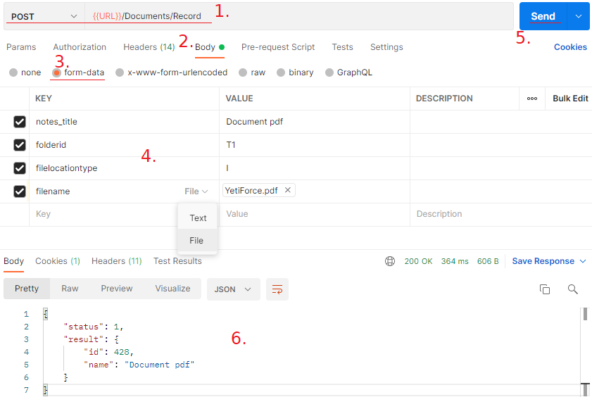

:::tip
This functionality is available for YetiForce version `6.2.0` and later
:::

The article describes how to add a new entry with an attachment in the Documents module via Rest API.

Before continuing, please research the methods and ways of communication described here: https://doc.yetiforce.com/api/

## 1. Create a document with an attachment

To create an entry in the Documents module use an API method the allows for record creation, i.e.


https://doc.yetiforce.com/api/#/BaseModule/ea3b9bea091cbde741323b5393901825

The difficult part when adding an attachment is the correct formulation of the query. As a standard, the module fields should be properly completed in the query, and in this case it will be no different.

Field names are available in the field edition panel in Software configuration → Standard modules → Edit fields

Fields responsible for adding an attachment:

- File type [filelocationtype]

  This field defines the type of attachment. Two values are available: I - Internal, E - External

- File name/WWW [filename]

  Attachment or link

Once you know what the structure of the Documents module looks like, you can proceed with API queries. Below you can find some examples of this type of queries:

### Postman



### Guzzle, PHP HTTP client

https://github.com/guzzle/guzzle

```php
$uri = 'https://example.com/webservice/RestApi/Documents/Record';
$options = [
   'headers' => [
     'User-Agent' => 'YetiForceRestApi',
     'x-api-key' => 'P0fzRUuzPNWC9pxYq3MeEUp6AJ9EJpWN',
     'x-token' => '9c65f656c9380b7066d992ec59c00c0d29147a579351742b0e9f43a73312f5be',
   ],
  'auth' => ['userName', 'Password'],
  'timeout' => 10,
  'connect_timeout' => 2
];
$httpClient = new \GuzzleHttp\Client($options);
$options['multipart'] = [
   ['name' => 'notes_title', 'contents' => 'Document pdf'],
   ['name' => 'filelocationtype', 'contents' => 'I'],
   [
     'name' => 'filename',
     'filename' => 'YetiForce.pdf',
     'contents' => file_get_contents('YetiForce.pdf')
   ]
];

$response = $httpClient->request('POST', $uri, $options)->getBody()->getContents();
```

### cURL, PHP

```php
$url = 'https://example.com/webservice/RestApi/Documents/Record';
$headers = [
   'User-Agent: YetiForceRestApi',
   'x-api-key: P0fzRUuzPNWC9pxYq3MeEUp6AJ9EJpWN',
   'x-token: 9c65f656c9380b7066d992ec59c00c0d29147a579351742b0e9f43a73312f5be',
   'Content-Type: multipart/form-data'
];
$userName = 'userName';
$password = 'Password';

$cf = new CURLFile(realpath('YetiForce.pdf'));
$ch = curl_init();
curl_setopt($ch, CURLOPT_URL, $url);
curl_setopt($ch, CURLOPT_HTTPHEADER, $headers);
curl_setopt($ch, CURLOPT_HTTPAUTH, CURLAUTH_ANY);
curl_setopt($ch, CURLOPT_USERPWD, "{$userName}:{$password}");
curl_setopt($ch, CURLOPT_RETURNTRANSFER, true);
curl_setopt($ch, CURLOPT_POST, true);
curl_setopt($ch, CURLOPT_POSTFIELDS, ['notes_title' => 'Document pdf', 'filelocationtype' => 'I', 'filename' => $cf]);

$response = curl_exec($ch);
```

## 2. Relating a document to another entry

The existence of an unrelated document in the system is pointless, therefore each entry in the Documents module should be related to a record in another module, for example Contact, Account, Ticket, or any other that can be related to a Document.

You don't have to create separate API queries to relate the document, you can do it at the time of creating the document by adding a few additional variables, such as:

- relationOperation (bool) /mandatory

  Determines that the created entry can be related

- sourceModule (string) /mandatory

  Name of the module that the document should be related to

- sourceRecord (int) /mandatory

  ID of the record that the document should be related to

- relationId (int) /optional

  ID of the relation between modules

  Mandatory if there are more than one relation between modules

Example:

```php
$httpClient = new \GuzzleHttp\Client($options);
$options['multipart'] = [
 ['name' => 'notes_title', 'contents' => 'Document pdf'],
 ['name' => 'filelocationtype', 'contents' => 'I'],
 [
     'name' => 'filename',
     'filename' => 'YetiForce.pdf',
     'contents' => file_get_contents('YetiForce.pdf')
 ],
 ['name' => 'relationOperation', 'contents' => true],
 ['name' => 'sourceModule', 'contents' => 'Contacts'],
 ['name' => 'sourceRecord', 'contents' => 124]
];
$response = $httpClient->request('POST', $uri, $options)->getBody()->getContents();
```
