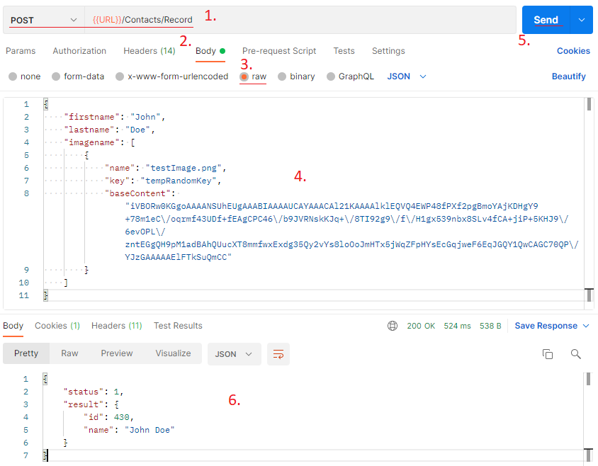

Niniejszy dokument zawiera instrukcję, jak do rekordu za pomocą API dodać plik graficzny w polach obsługujących takie pliki.

Before continuing, please research the methods and ways of communication described here: https://doc.yetiforce.com/api/

The YetiForce application has two types of fields that support graphic files:

- Image file
- Image files (many)


## Adding an image

To add an image file to a record, use the standard endpoint for creating or editing a record via the POST (create) or PUT (edit) method.

```bash
/webservice/WebserviceStandard/{moduleName}/Record
```

The file field is added similarly to other record fields, with the difference that its value is not a text string or number, but an array of objects. An image file object created via the API requires three elements:

- `name` - file name.

- `key` - a random string of characters, unique within the graphic files of a given field.

- `baseContent` - an image file converted to base64 format. Do not include the fragment with the MIME type (e.g. `data:image/jpeg;base64,`).

Below is an example of adding an image file to a contact using Postman, where `imagename` is the field name specified in the module settings.


