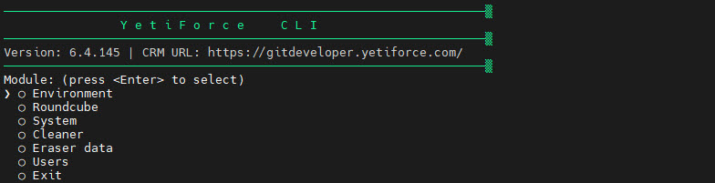
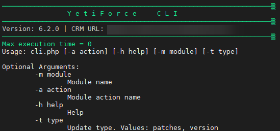

:::tip
Funkcjonalność dostępna od wersji YetiForce `6.2.0` i później
:::

Description of the CLI (Command Line Interface) to support custom YetiForce operations.



## How to launch YetiForce CLI

Always launch the console from the main YetiForce system catalogue, that is, where the cli.php file is located.

:::tip
YetiForce CLI musi być zawsze uruchamiany na użytkowniku systemu operacyjnego, który jest właścicielem plików systemu YetiForce.
:::

Possible commands depending on the environment:

```bash
php cli.php
/usr/local/php74/bin/php74 cli.php
sudo -u yfprod php cli.php
```

## Help

Help available after adding the `-h` argument

```bash
php cli.php -h
```



## Available YFCLI modules

import DocCardList from '@theme/DocCardList';

<DocCardList />
