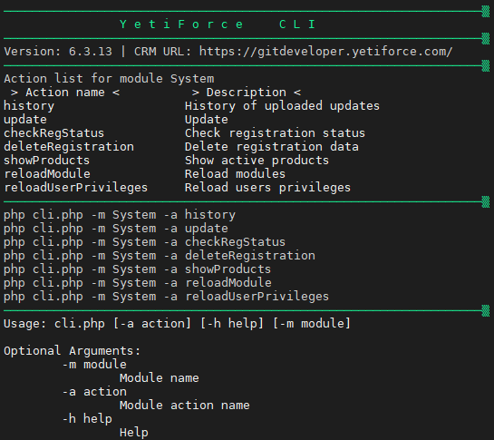
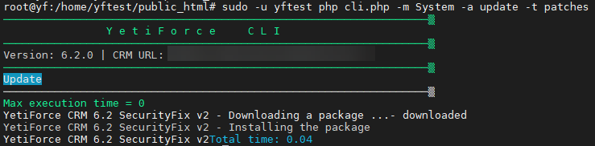
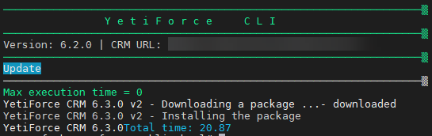

# YetiForce system management via the console

This guide describes the basic console commands for managing the YetiForce system. All operations are performed via the command line interface (CLI), allowing for quick and efficient system management.



## System update history

To check the history of all installed updates, use the following command:

```bash
php cli.php -m System -a history
```

## System update

Different types of system updates are available:

### Standard update

Basic system update command:

```bash
php cli.php -m System -a update
```

### Security fixes installation

This command will install all available fixes and service packs:

```bash
php cli.php -m System -a update -t patches
```



Update the system to the next stable version

```bash
php cli.php -m System -a update -t version
```



## Registration management

### Check registration status

Check the current registration status:

```bash
php cli.php -m System -a checkRegStatus
```

### Remove registration data

In case you have to reset the system registration, use the following command:

```bash
php cli.php -m System -a deleteRegistration
```

### Display active add-ons

Display a list of all purchased add-ons in the system:

```bash
php cli.php -m System -a showProducts
```

## Refresh system components

### Reload modules

Refresh all system modules (useful after making configuration changes):

```bash
php cli.php -m System -a reloadModule
```

### Update user permissions

Update all user permissions in the system:

```bash
php cli.php -m System -a reloadUserPrivileges
```

### Refresh menu

Reload the menu structure in the system:

```bash
php cli.php -m System -a reloadMenus
```
