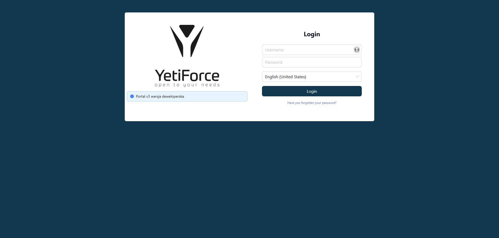
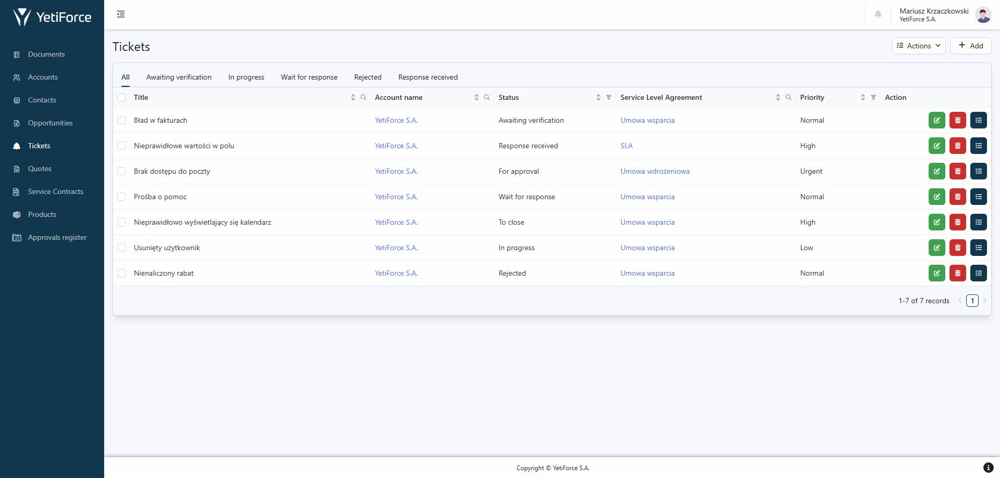
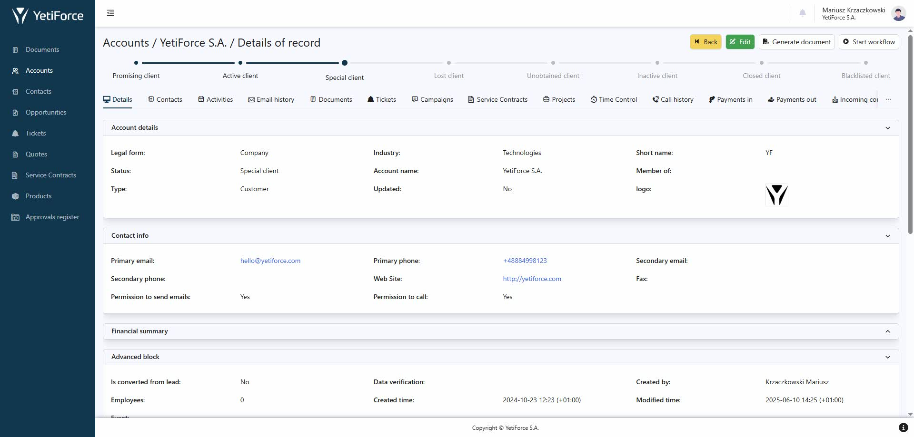
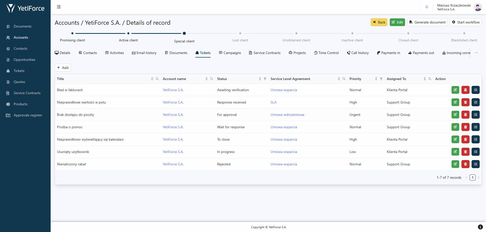
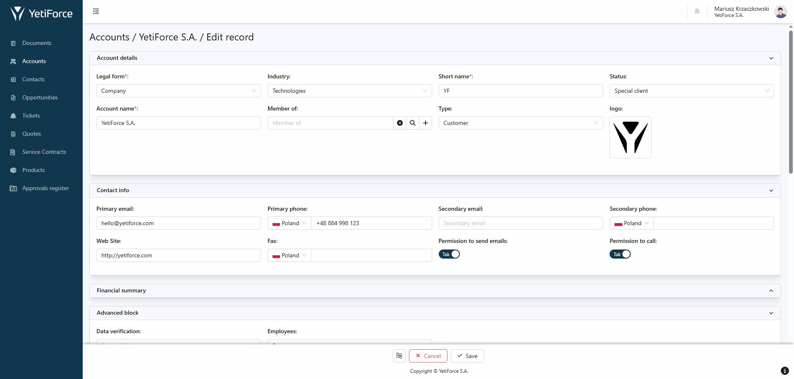
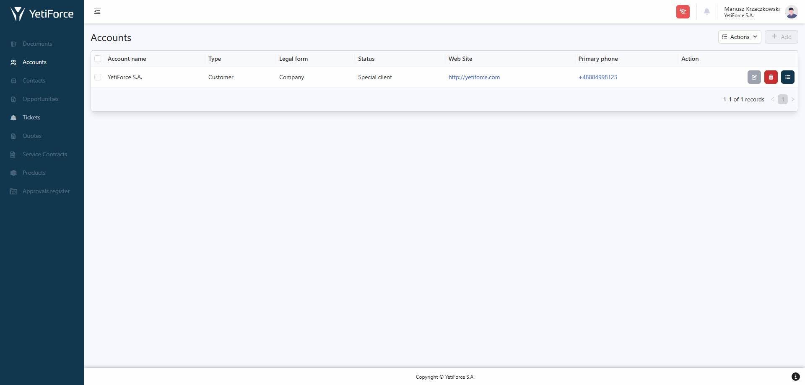

## Description

The Customer Portal version 3 is a dedicated tool that facilitates communication between your company to and its Customers. With access to various types of data (e. g. orders or tickets), you can ensure a transparent flow of information with Customers, and also significantly reduce the number of questions and phone calls from them.

The Customer Portal uses the extended Webservice Premium API, which provides full functionality and integration with the YetiForce system. Portal configuration includes setting roles, profiles, users and menus, which allows you to customize access and interface to the needs of users. In comparison to the previous version of the Portal, it is created in React technology, has more functionalities and is fully compatible with the latest version of the YetiForce system (7.x).

:::info

If you need more information, email us at hello@yetiforce.com

:::

## Screenshots

### Login

### Records list

### Record preview

### Related module

### Edit record

### Offline mode, access after losing internet connection

