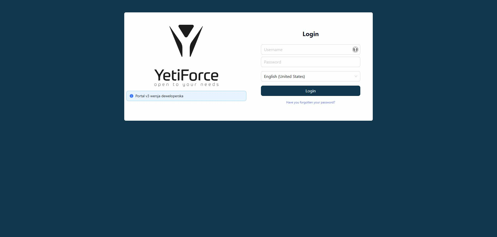
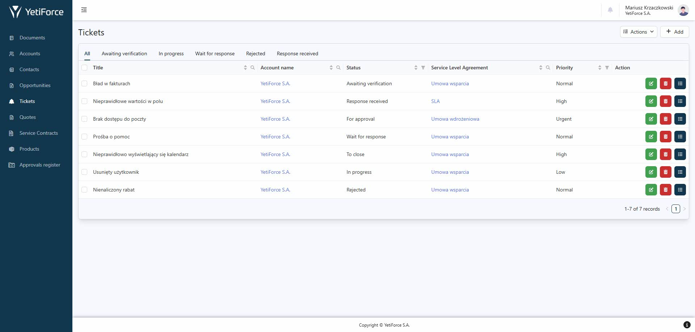
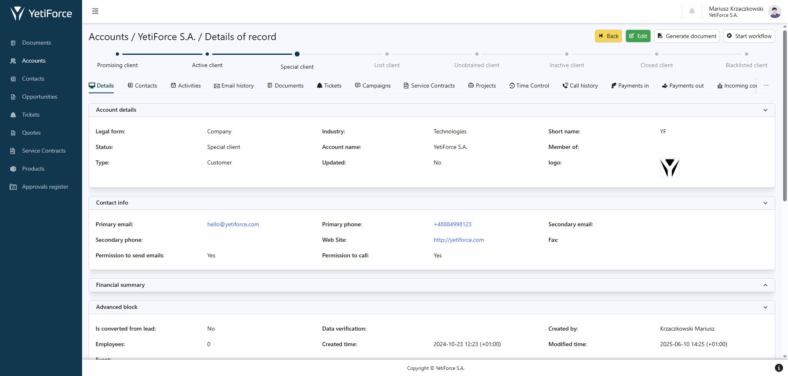
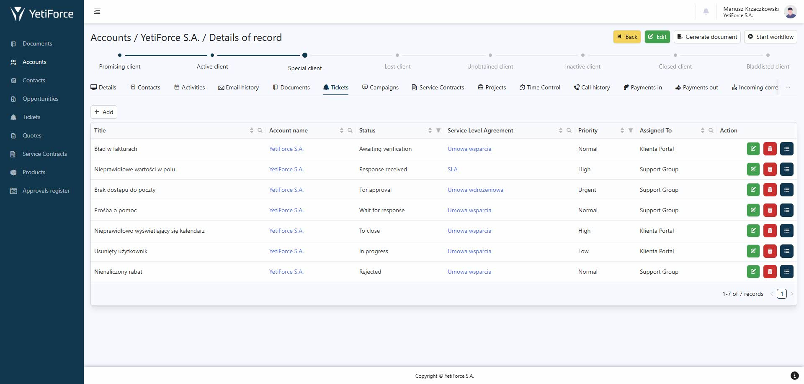
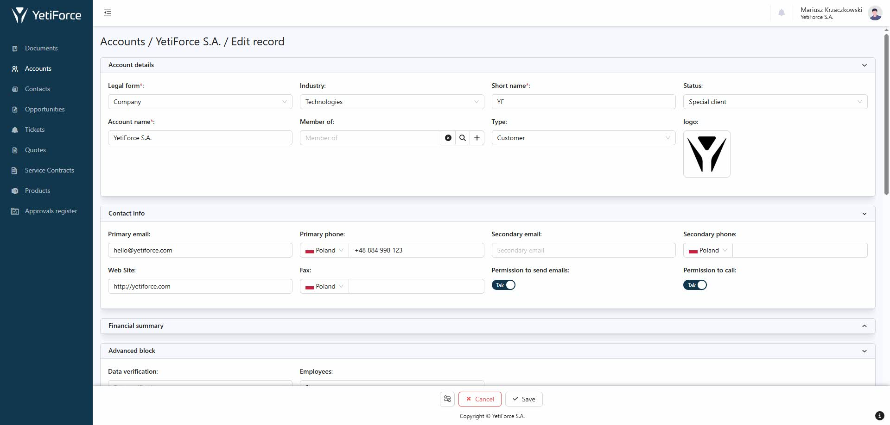
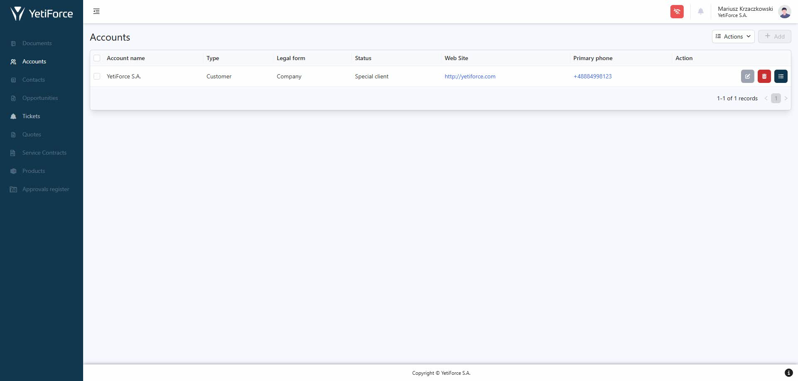

## 🚀 Customer Portal v3 - modern communication with customers

**Customer Portal v3** is a dedicated, modern tool enabling your company to effectively communicate with its customers, partners, and all external companies. Built with **React** technology, it offers improved performance and user experience.

### 📊 Key business benefits

- **Transparent information flow:** Customers have direct access to their data (e.g. orders, tickets, invoices).
- **Reduce the customer service team's workload:** Significantly reduce the number of customer questions and calls thanks to self-service.
- **Full integration with the YetiForce system:** The portal uses the extended **Webservice Premium API**, ensuring secure and full data synchronization.
- **Flexible configuration:** Ability to define roles, profiles, users and menus, allowing you to perfectly tailor access and interface to your needs.

### ⚙️ Technology and Compatibility

- **Frontend:** Built in **React** for fast and smooth performance.
- **Backend:** Integrates with YetiForce via **Webservice Premium API**.
- **Compatibility:** Fully compatible with the latest version of the YetiForce system (7.x).

## 🖼️ Screenshots

### 1. Login

Modern and responsive login screen.

### 2. Records list

Clear list views with advanced filters and sorting.

### 3. Record preview

Detailed view of a single record with all related data.

### 4. Related module

Navigation between related records (e.g. Account → Orders).

### 5. Edit record

Edit forms with validation and support for field dependencies.

### 6. Offline mode

The portal works offline when internet connection is lost.

## 📞 Looking for more information?

Contact us to discuss implementing the Customer Portal v3 for your company:
📧 **hello@yetiforce.com**

---

Customer Portal v3 is part of the YetiForce ecosystem - an open, free and advanced system that offers more possibilities than a regular CRM.
