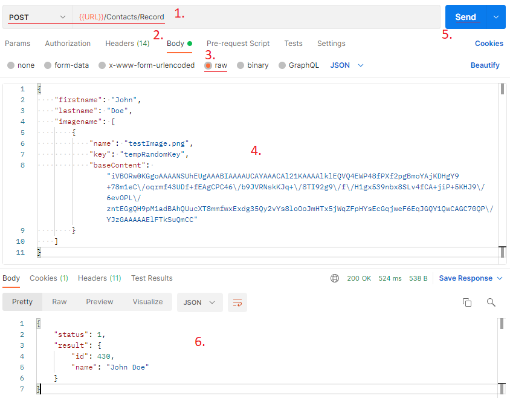

This article describes how to add images via Rest API in fields that support such files in YetiForce.

The application has two types of fields that support graphic files, namely:

- Image
- Image (many)

**Before continuing, please research the methods and ways of communication described here: https://doc.yetiforce.com/api/**

## Adding an image

The difficulty with adding a graphic file is the proper preparation of fields in the query. At the beginning, you should prepare a list of fields that should be completed when creating / editing a record via API.

Module field structure can be found in the field edition panel in [Software configuration → Standard modules → Edit fields](/administrator-guides/standard-modules/edit-fields/).

Once you're familiar with the structure you can move on to constructing the queries.

Each graphic file created at the API level requires three variables:

- **name**

  File name

- **key**

  Random of characters string, unique within the pool of graphic files of a given field

- **baseContent**

  Graphic file converted to base64

Below you can find an example of an image added to a Contact using Postman:

