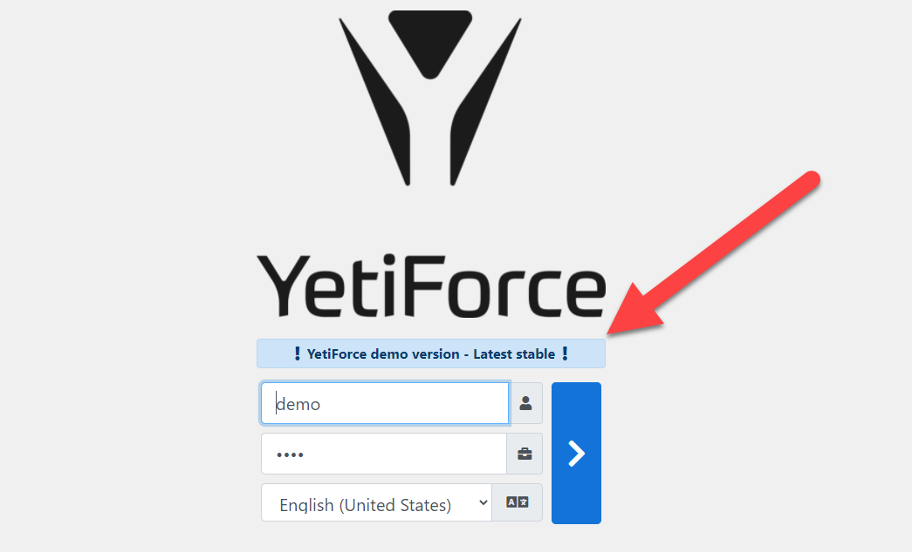
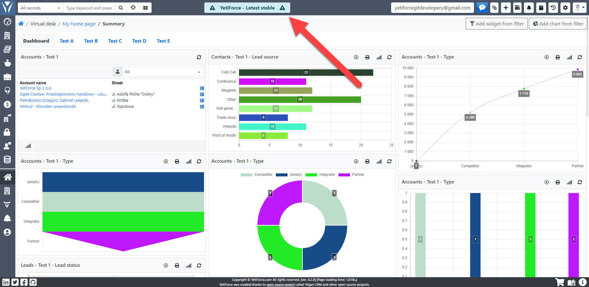

Migrating or restoring the system from backup takes place in a few steps. Please read the information below to avoid any errors and mistakes.

## Video guide

import Tabs from '@theme/Tabs';
import TabItem from '@theme/TabItem';
import ReactPlayer from 'react-player';

<Tabs groupId="AAnD_Npa0ZM">
	<TabItem value="youtube-AAnD_Npa0ZM" label="🎬 YouTube">
		<ReactPlayer
			url="https://www.youtube.com/watch?v=AAnD_Npa0ZM"
			width="100%"
			height="500px"
			controls={true}
		/>
	</TabItem>
	<TabItem value="yetiforce-AAnD_Npa0ZM" label="🎥 YetiForce TV">
		<ReactPlayer url="https://public.yetiforce.com/tutorials/system-migration.mp4" width="100%" height="500px" controls={true} />
	</TabItem>
</Tabs>

## Upload files to the web root directory

It is best to unpack the files directly on the server, which will preserve the original permissions on the files.

:::tip

If you have a separate copy of the storage directory, like in case of [YetiForce Cloud](https://yetiforce.com/pl/marketplace/chmura) you need to unpack the backup copy to `__YETIFORCE_PATH__/storage` so that there is no storage directory in this directory, and only the following data directories instead: https://github.com/YetiForceCompany/YetiForceCRM/tree/developer/storage

:::

## Upload the database

Upload the database using the CLI console (recommended) or a database client eg. DBeaver, Database Workbench , SQLyog

```sql
mysql -P 3306 -h 127.0.0.1  -u yetiforce -p yetiforce < dump.sql
```

## Update the configuration files

After uploading the files and importing the database we should update the following files:

- [config/Main.php](https://doc.yetiforce.com/code/classes/Config-Main.html#property_site_URL)

```php
/** Backslash is required at the end of URL */
public static $site_URL = 'https://example.yetiforce.cloud/';
```

- [config/Db.php](https://doc.yetiforce.com/code/classes/Config-Db.html)

```php
/** Gets the database server */
public static $db_server = 'localhost';
/** Gets the database port */
public static $db_port = '3306';
/** Gets the database user name */
public static $db_username = 'root';
/** Gets the database password */
public static $db_password = '';
/** Gets the database name */
public static $db_name = 'yetiforce';
```

- [config/Security.php](https://doc.yetiforce.com/code/classes/Config-Security.html)

The parameters below are also worth checking:

```php
/** Restricted domains */
public static $EMAIL_FIELD_RESTRICTED_DOMAINS_VALUES = ['yetiforce.com','github.com'];

/** Allowed domains for loading images, used in CSP. */
public static $allowedImageDomains = [];

/** Generally allowed domains, used in CSP. */
public static $generallyAllowedDomains = ['yetiforce.com', 'github.com'];

/** List of allowed domains for fields with HTML support */
public static $purifierAllowedDomains = ['yetiforce.com', 'github.com'];
```

Verify if enforcing HTTPS is enabled. There might be problems if HTTPS was on the old server and the redirection was enabled and the new server has no active HTTPS.

```php
/** Force site access to always occur under SSL (https) for selected areas. You will not be able to access selected areas under non-ssl. Note, you must have SSL enabled on your server to utilise this option. */
public static $forceHttpsRedirection = false;
```

Check if communication through `proxy` is enabled

```php
/** Proxy protocol: http, https, tcp */
public static $proxyProtocol = '';

/** Proxy host */
public static $proxyHost = '';

/** Proxy port */
public static $proxyPort = 0;

/** Proxy login */
public static $proxyLogin = '';

/** Proxy password */
public static $proxyPassword = '';
```

- [config/Components/Backup.php](https://doc.yetiforce.com/code/classes/Config-Components-Backup.html)

If you have a backup directory available on the server, you can enable it (this may require configuration of file permissions)

```php
/** Backup catalog path. */
public static $BACKUP_PATH = '';
```

## Check if configuration complies with requirements

Whenever the system is migrated, restored from backup, or the LAMP server is updated, it is important to check the system’s configuration in the built-in verification tool ([Administrator documentation → Logs → Server - configuration](/administrator-guides/logs/server-configuration)) or in the article [YetiForce requirements](/introduction/requirements/).

:::warning

Don't use the server if it doesn't meet the requirements, as it may result in data loss. Fix any parameters that are highlighted in yellow or red.

:::

It is also important that the owner of the files is the same as the user running the web server (apache, nginx).

## CRON

Run [CRON](/administrator-guides/automation/cron) and verify its operation.

## Re-register your system

Migrating to a new server or restoring it from a backup requires [re-registration](/administrator-guides/app-id#why-does-the-app-id-change) of the system.

## Update addons

Some addons may need to be reconfigured when changing the location or address of the system, eg. [`System settings → Integration → Mail integration panel`](/administrator-guides/integration/mail-integration-panel/).

### YetiForce Outlook Integration Panel

Requires reinstallation and the installation of a new XML file.

The old addon installed in Outlook should be removed and the new XML file from the system panel should be downloaded according to the [instructions](/6.5.0/administrator-guides/integration/mail-integration-panel/outlook).

## Create a test environment

If you create a test environment, it is worth introducing some important changes that will help you distinguish and secure the environments.

### Change user passowrds

### Add visuals

Display a test environment notice on the login page and on the top bar of the system.

From version `6.2` it is possible to add in the configuration file [config/Main.php](https://doc.yetiforce.com/code/classes/Config-Main.html#property_headerAlertMessage) some additional messages.

```php
/** Header alert message */
public static $headerAlertMessage = '';

/** Header alert type, ex. alert-primary, alert-danger, alert-warning, alert-info */
public static $headerAlertType = '';

/** Header alert icon, ex.  fas fa-exclamation-triangle, fas fa-exclamation-circle, fas fa-exclamation, far fa-question-circle, fas fa-info-circle */
public static $headerAlertIcon = '';

/** Login page alert message */
public static $loginPageAlertMessage = '';

/** Login page alert type, ex. alert-primary, alert-danger, alert-warning, alert-info */
public static $loginPageAlertType = '';

/** Login page alert icon, ex.  fas fa-exclamation-triangle, fas fa-exclamation-circle, fas fa-exclamation, far fa-question-circle, fas fa-info-circle */
public static $loginPageAlertIcon = '';
```





### Change the sender name in SMTP or disable the CRON task responsible for sending out emails

Messages sent from the new environment will look the same as the ones sent from the production environment, so it is worth disabling or changing the sender names in SMTP to be able to distinguish between these e-mail messages.

Panel: [System settings → Automation → CRON](/administrator-guides/automation/cron)

## Change API keys

It is worth changing the API access data to make them different for each environment. So that someone who has access to the test version will not be able to get data from the production version.

Panel: [System settings → Integration → Web service - Applications](/administrator-guides/integration/webservice-apps/)

:::warning

In order to properly transfer the system to another server, you should make a complete copy of the system (files and database). It is best to use compression software, e.g.

```bash
zip -r `date +"%Y%m%d_%H%M"`.zip __YETIFORCE_PATH__ -q
```

```bash
tar -zcvf /var/www/html/`date +"%Y%m%d_%H%M"`.tar.gz /var/www/html/
```

**No error can occur during the transfer or recovery of the system, as the database may later turn out to be corrupted.**

:::
