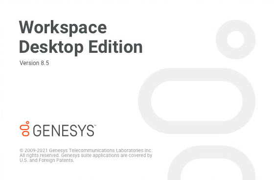
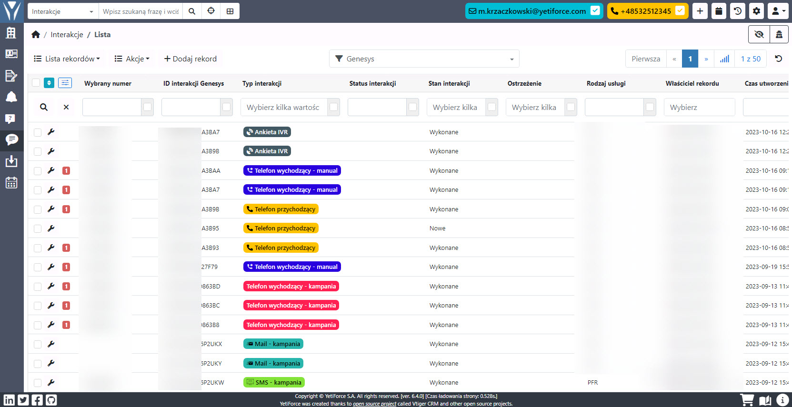
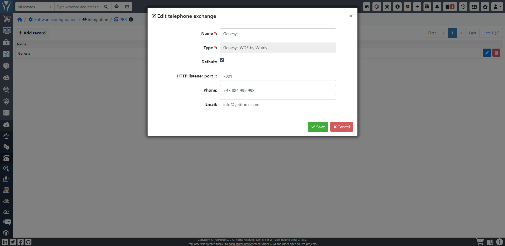
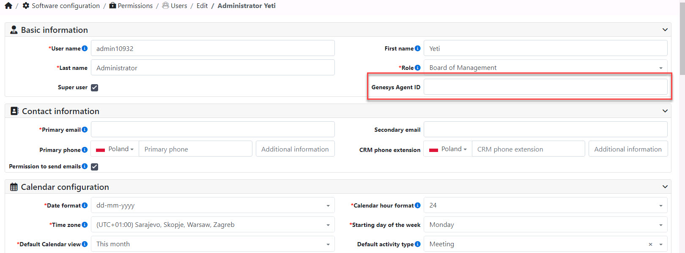
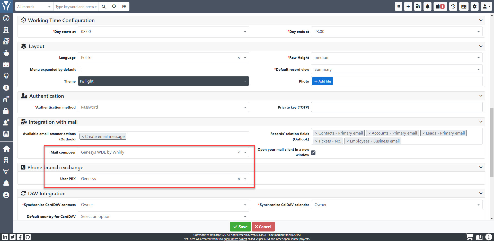
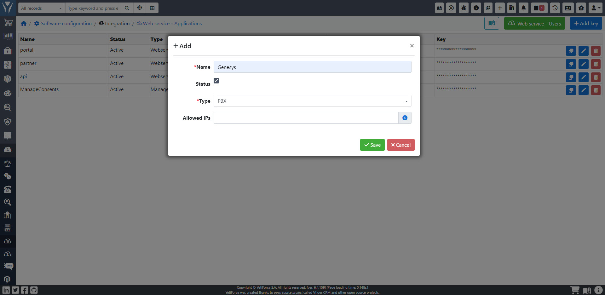
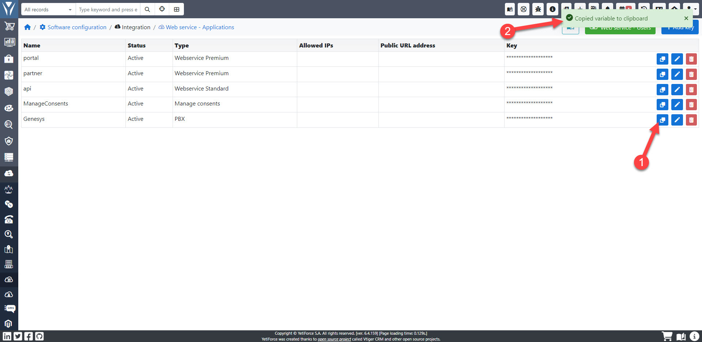
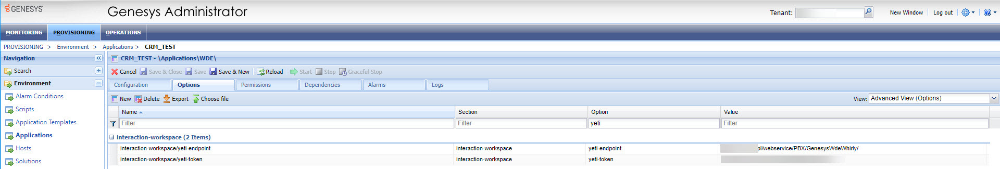

:::tip This functionality is available for YetiForce version 7.0 and later
:::

:::warning A dedicated extension from Whirly that supports existing processes in the Genesys system is used for the integration.
:::

PBX integration via Genesys Workspace Desktop Edition.

Integration with the Genesys Contact Center platform requires dedicated integration implementation as it depends on the processes present in each company.

Advantages and capabilities:

- works regardless of the logged in user
- integrates with a dedicated API
- dynamically presents information available in the YetiForce system when receiving a call
- handles and records GDPR consents accepted on IVR
- handles telephone calls, emails, messenger messages, website chat, SMS/Mail/telephone campaigns
- supports IVR surveys
- searching for companies and contacts based on the information provided, e.g., tax identification number + token, telephone number, email, messenger login
- secure communication using HMAC signature
- history of all interactions with the company and contacts
- ability to automatically create data

## Activation

Due to the high complexity of the processes, the integration requires an extension implemented in Genesys from Whirly, and a dedicated implementation in the YetiForce system.

## Configuration

In order to enable the integration, follow the steps below:

### Add configuration to PBX

Add an entry to the PBX with the following type: `Genesys WDE by Whirly`

Provide the following information in the window:

- HTTP listening port - the number of the local port used by the WDE application for listening
- Phone - required for outgoing calls; the PBX supports multiple phone numbers and you must specify which one is used when a phone number is clicked.
- Email - required for sending emails, the PBX supports emails and you must specify which address is used when you click on an email address.

### Activation for users

The next step is to activate the integration for users; by default the system uses basic protocol support for telephone and e-mail address.

Go to the user whose integration you want to enable and find the fields:

- Genesys Agent ID (block `Basic information`) - enter the user's login in Genesys WDE

- Mail composer (block `Integration with mail`) - select `Genesys WDE by Whirly`
- User PBX (block `Phone branch exchange`) - select the name you previously entered in [Add configuration to PBX](#add-configuration-to-pbx)

### Add configuration to API

Each interaction sends a request to the API with full data and in response the YetiForce system returns a URL to be enabled for the user in Genesys WDE.

In oder to do that add PBX type configuration in [`Software configuration → Integration → Web service - Applications`](/administrator-guides/integration/webservice-apps/).

Then copy the key and paste it in Genesys Administrator configuration.

### Add configuration to Genesys Administrator

Enter the following parameters in the Genesys Administrator panel:

- Endpoint `__YETIFORCE_PATH__`/webservice/PBX/GenesysWdeWhirly/
- Token/key generated in `Web service - Applications`

## External links

- https://www.genesys.com/collateral/genesys-workspace
