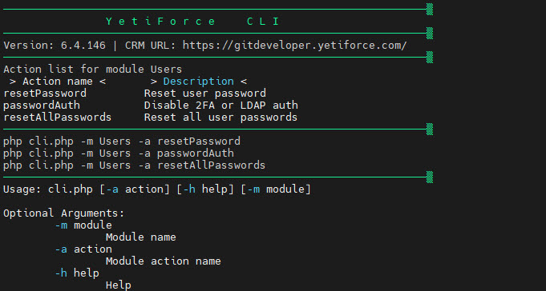
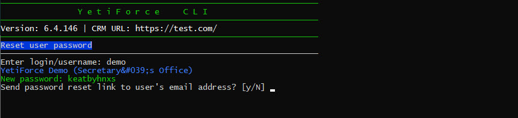
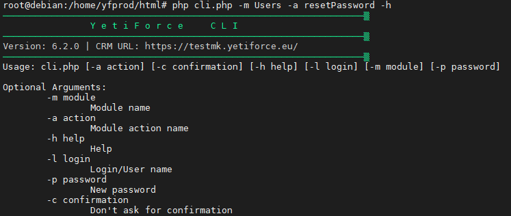
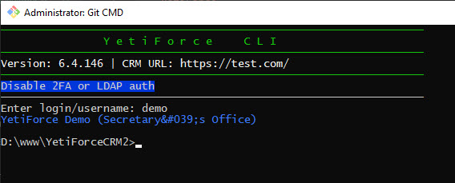
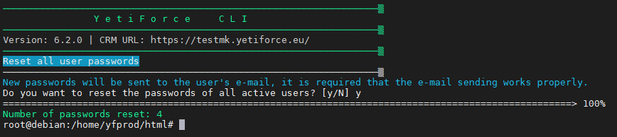

### Reset user password

```bash
php cli.php -m Users -a resetPassword
```



Możliwe parametry



### Disable 2FA or LDAP auth

```bash
php cli.php -m Users -a passwordAuth
```



### Reset all user passwords

```bash
php cli.php -m Users -a resetAllPasswords
```


