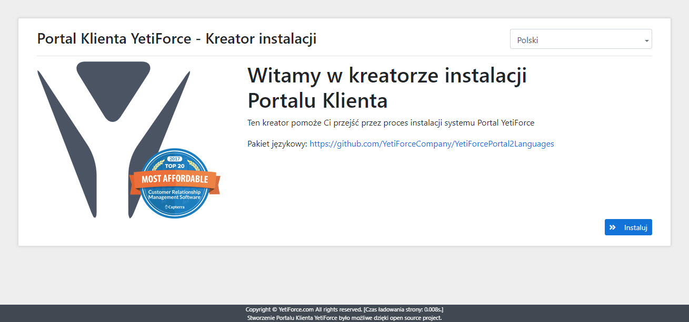
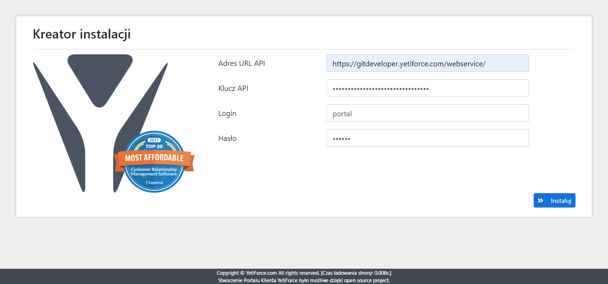

In this article, it will be presented how to quickly install [YetiForce Portal 2](https://github.com/YetiForceCompany/YetiForcePortal2). The portal can be used as a place for a customer, vendor, or partner. It is a universal tool for communicating with all the people we cooperate with.

:::tip

**Make sure to read all the information below before attempting to install YetiForce Portal2**

:::

import Tabs from '@theme/Tabs';
import TabItem from '@theme/TabItem';
import ReactPlayer from 'react-player';

<Tabs groupId="Language installation and update">
	<TabItem value="youtube" label="🎬 YouTube">
		<ReactPlayer
			url="https://www.youtube.com/watch?v=V-2x00bb4CI"
			width="100%"
			height="500px"
			controls={true}
		/>
	</TabItem>
	<TabItem value="yetiforce" label="🎥 YetiForce TV">
		<ReactPlayer url="/video/portal-installation.mp4" width="100%" height="500px" controls={true} />
	</TabItem>
</Tabs>

## Requirements

Before the installation, check if your server complies with all the requirements. The portal has the same requirements as the [YetiForce system](/introduction/requirements/)

:::important
A person who is going to install the Portal system should have at least basic knowledge of web servers, databases and server privileges. 99% of installation issues come from people with insufficient experience attempting to install the system. If you are not sure whether you manage on your own, you can ask somebody with adequate IT expertise. The entire installation process will take up from 2 to 10 minutes.
:::

A simplified installation manual can be found at [github YetiForcePortal2](https://github.com/YetiForceCompany/YetiForcePortal2#-installation)

## YetiForcePortal2 installation

The portal is installed in the same way as the YetiForce system - using the wizard in the browser.

### Step 1 - Download and upload system files

First, prepare the installation files. You can download the portal from our [official download sources](/6.5.0/introduction/download).

:::warning

We recommend downloading the `complete` versions, e.g. `YetiForcePortal2-6.2-complete.zip`. If you download a version that is not marked as `complete`, you will have to install the libraries using `yarn` and `composer` before installing the system.

The right order is important - first `yarn`, then `composer`.

A sample installation script can be downloaded from [here](https://github.com/YetiForceCompany/YetiForceCRM/blob/developer/tests/setup/dependency.sh).

:::

- Unzip the file, with e.g 7-Zip.
- Copy the directory to a web server, using e.g. FileZilla, WinSCP.
- Start the installation wizard from the web level (where you copied the YetiForce Portal files) and follow the steps provided.

Or from the bash console:

```bash
cd /home/yfprod/html/
wget -O YetiForcePortal2.zip https://github.com/YetiForceCompany/YetiForcePortal2/releases/download/6.4/YetiForcePortal2-6.4-complete.zip
unzip YetiForcePortal2.zip
rm YetiForcePortal2.zip
chown -R yfprod:yfprod /home/yfprod/html/
```

### Step 2 - Run the installation wizard

Run the target address of your Portal in the browser window, the system should show the installation wizard. If not, there may be some problems, you can try running the address:**SITE_URL**/index.php?module=Install&view=Install np. https://gitdevportal.yetiforce.com/index.php?module=Install&view=Install



You can select the language of the installation on the start screen.

### Step 3 - Enter access data

:::warning

**This step requires active API access !!!**

In case of problems, please refer to the documentation and information on [github](https://github.com/YetiForceCompany/YetiForcePortal2#-installation)

Access data can be found in [System configuration > Integration > Web service - Applications](/administrator-guides/integration/webservice-apps/) in the YetiForce system
:::



### Step 4 - Portal login page

After clicking `Install` the login page will appear. Enter the login data created in the panel [`System configuration > Integration > Web service - Users`](/administrator-guides/integration/webservice-users/)


