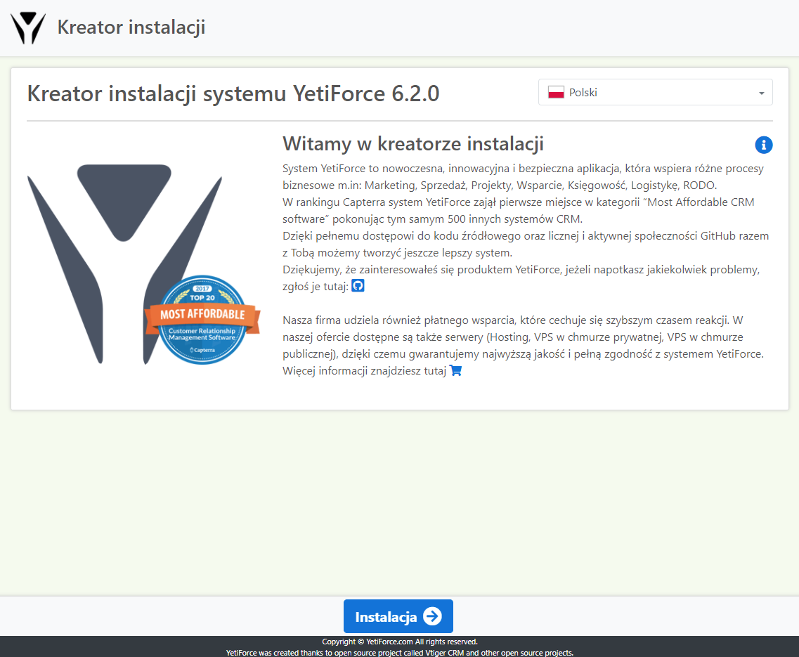
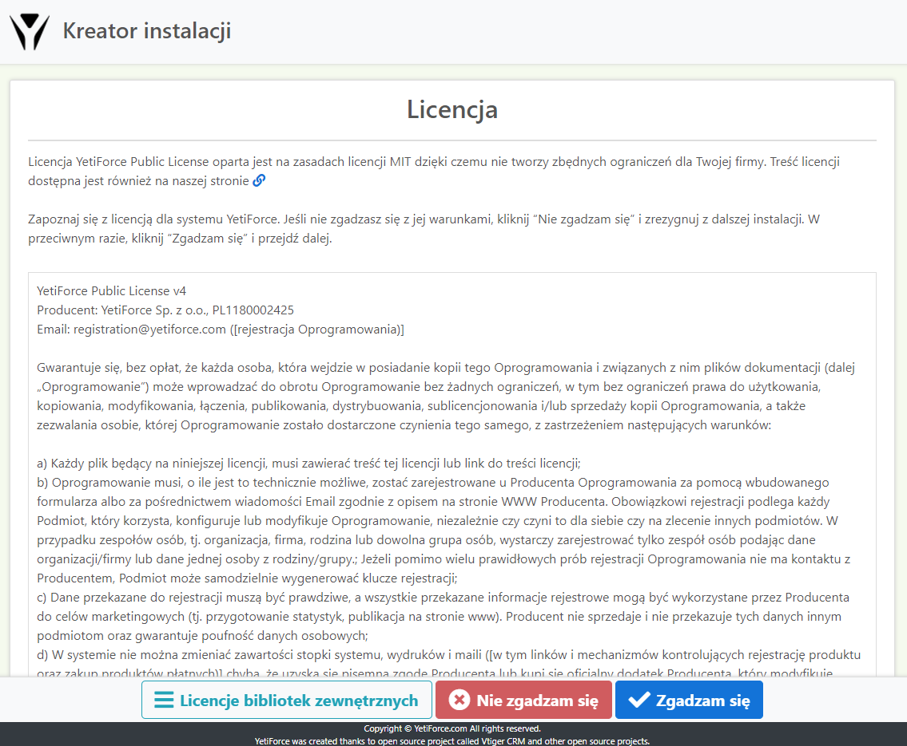
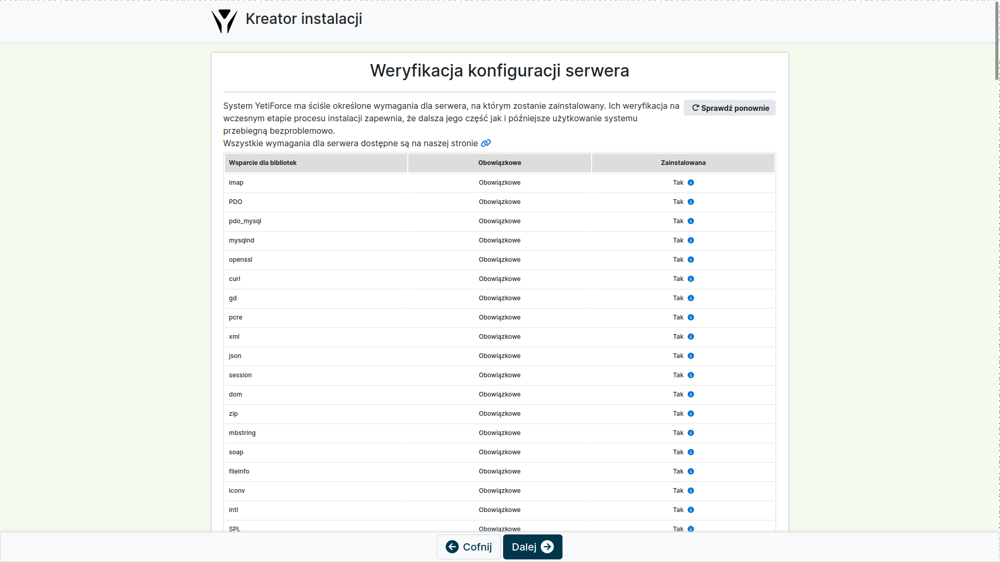
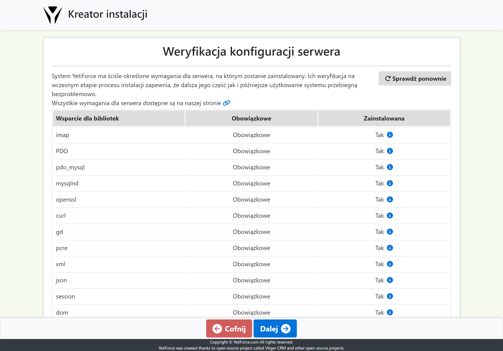
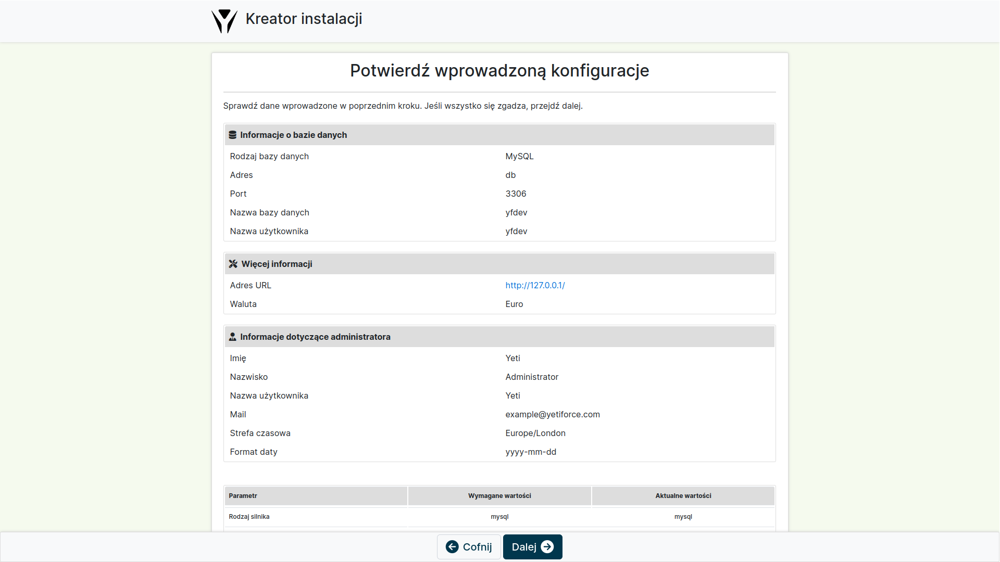
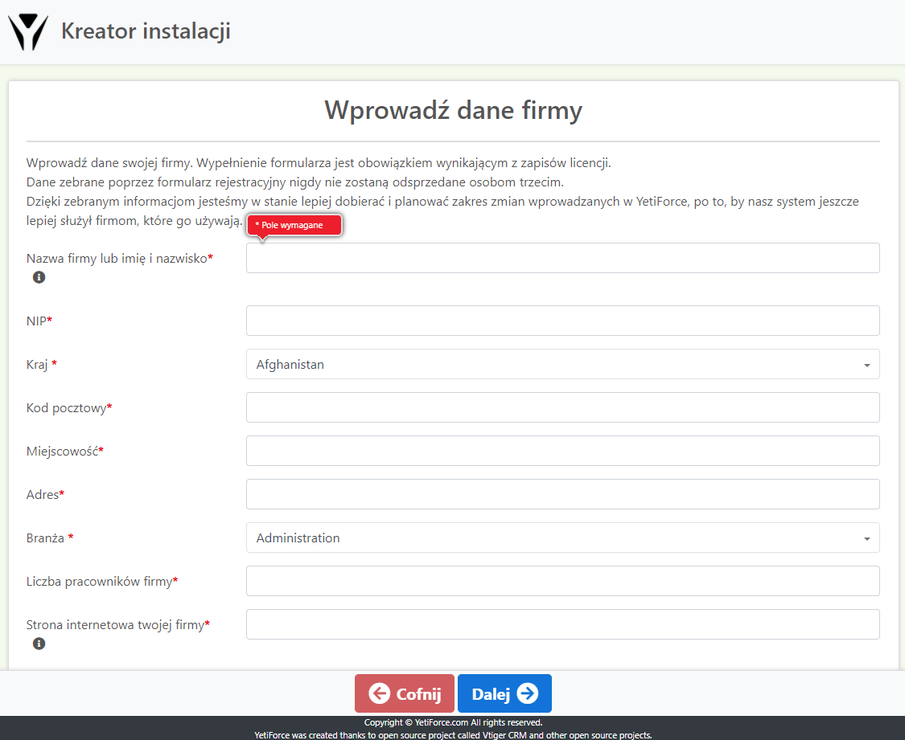

W tym artykule znajdziesz wszystko, co powinieneś wiedzieć o instalacji YetiForce - niezbędne informacje, instrukcję instalacji krok po kroku, oraz najczęściej pojawiające się błędy i problemy. **Koniecznie zapoznaj się ze wszystkimi poniższymi informacjami przed przystąpieniem do instalacji systemu.**

## Jak zainstalować system YetiForce?

Proces instalacji YetiForce jest bardzo prosty. Instalacja YetiForce odbywa podobnie do instalacji większości aplikacji webowych, czyli za pomocą kreatora przez przeglądarkę.

Przed instalacją sprawdź czy twój serwer jest zgodny z wymaganiami: [Wymagania systemu YetiForce](requirements) lub [Jak skonfigurować serwer z Debian 10 dla systemu YetiForce](/developer-guides/environments/debian-10)

:::important

Osoba instalująca system powinna mieć przynajmniej podstawową wiedzę w zakresie zarządzania serwerem WWW, baz danych czy też uprawnień na serwerze. 99% problemów instalacyjnych wynika z niewystarczającej wiedzy osób, które instalują aplikację. If you are not sure whether you can manage on your own, you can ask somebody with adequate IT expertise. Cała operacja instalacji zajmie maksymalnie 2 - 30 minut. Instalacja YetiForce jest podobna do instalacji takich aplikacji jak: WordPress, Joomla, Drupal. Różnice pomiędzy poszczególnymi narzędziami są niewielkie. Tak więc, jeżeli poradziłeś sobie z instalacją systemu klasy CMS, to poradzisz sobie również z YetiForce.

:::

## Pobierz i wgraj pliki systemu

W pierwszej kolejności przygotuj pliki instalacyjne. **[Pobierz YetiForce](download) z naszych oficjalnych źródeł.**

:::warning

Zalecamy pobranie wersji "complete", na przykład `YetiForceCRM-6.4.0-complete.zip`.  Jeśli została pobrana inna wersja niż "complete", to przed instalacją systemu należy zainstalować biblioteki przy użyciu `yarn` i `composer`. Ważna jest kolejność - najpierw `yarn`, potem `composer`. Przykładowy skrypt instalacyjny możesz pobrać [stąd](https://github.com/YetiForceCompany/YetiForceCRM/blob/developer/tests/setup/dependency.sh).

:::

- Pobrany plik ZIP rozpakuj, np. za pomocą programu [7-Zip](http://7-zip.org/).
- Katalog z systemem CRM, który otrzymasz po rozpakowaniu pliku ZIP, skopiuj na serwer WWW, np. za pomocą programu [WinSCP](https://winscp.net/).
- Następnie postępuj zgodnie z kreatorem, którego wywołasz z poziomu WWW tam, gdzie skopiowałeś pliki YetiForce CRM.

Lub z konsoli bash

```bash
cd /home/yfprod/html/
wget -O YetiForceCRM.zip https://github.com/YetiForceCompany/YetiForceCRM/releases/download/6.2.0/YetiForceCRM-6.2.0-complete.zip
unzip YetiForceCRM.zip
chown -R yfprod:yfprod /home/yfprod/html/
```

## Krok 1 - Uruchomienie kreatora instalacji

Uruchom w oknie przeglądarki adres docelowy twojego systemu YetiForce, system powinien pokazać kreator instalacji. Jeśli nie, to może oznaczyć że wystąpiły jakieś problemy, możesz spróbować uruchomić adres: **SITE_URL**/install/Install.php np. https://gitdeveloper.yetiforce.com/install/Install.php



Na ekranie startowym w kreatorze instalacji dostępna jest możliwość konfiguracji języka instalacji (domyślnie język jest predefiniowany na podstawie języka przeglądarki). Przejdziemy przez kolejne etapy nowej instalacji. **Kliknij `Zainstaluj` i przejdź do następnego kroku.**

## Krok 2 - Zapoznanie się z warunkami licencji i ich akceptacja

W drugim kroku kreator wymaga zaakceptowania licencji. Licencja YetiForce jest bardzo podobna do licencji MIT, jest otwarta i pozwala na dowolną modyfikację kodu z pozostawieniem informacji o pierwotnym autorze. Przeczytaj w pełni informacje o licencji, ponieważ z perspektywy firmy, dla której wdrażasz oprogramowanie, zapisy i warunki licencji są istotne.



## Krok 3 - Wybierz rodzaj instalacji

Zdecyduj, gdzie chcesz zainstalować system - możesz wybrać własny serwer albo dokonać zakupu naszego hostingu lub chmury. Jeśli zdecydujesz się na jedną z naszych usług, to po kliknięciu przycisku `Kup` będziesz miał możliwość dokonania płatności.



## Krok 4 - Weryfikacja konfiguracji serwera

W czwartym kroku jest widoczna aktualna konfiguracja serwera WWW oraz zalecenia, jakie stawia system YetiForce (czyli co trzeba zmienić i na jaką wartość). Należy pamiętać, że w zależności od wymagań, jakie się stawia aplikacji CRM, konfiguracja ta może ulec zmianom. Firma wdrożeniowa powinna uwzględnić zmiany we własnym zakresie. Dla przykładu, jeżeli generujesz duże raporty, których czas generowania jest dłuższy niż parametr `max_execution_time`, wtedy należy ten parametr ustawić tak, aby czas wykonywania skryptu był zawsze dłuższy niż czas generowania raportu. W przeciwnym wypadku taki raport może się nie wygenerować.

Dla pewności, poproś swojego administratora, aby zapoznał się z tymi [wymaganiami dla serwerów WWW](/introduction/requirements/). Jeżeli nie będą spełnione wszystkie wymagane parametry i będziesz chciał przejść dalej, to aplikacja pokaże komunikat ostrzegawczy.

Świadomy ryzyka związanego z niepoprawną konfiguracją środowiska WWW, możesz przejść dalej, klikając przycisk `Dalej`.



## Krok 5 - Konfiguracja danych dostępowych

Na tym etapie musisz wypełnić podstawowe dane dostępowe do bazy danych i ustawić parametry wyjściowe dla systemu CRM. Na podstawie tych danych zostanie utworzona baza danych (gdy ta opcja została aktywowana). Na podstawie tych danych system utworzy bazę danych (o ile opcja ta została aktywowana), wgra strukturę bazy danych razem z podstawowymi danymi oraz utworzy podstawowe konto administratora, do którego będziesz mógł się zalogować po instalacji.

Jeżeli wprowadzisz nieprawidłowe dane dostępowe do bazy danych pokaże się błąd.

W takim wypadku musisz cofnąć się do ekranu poprzedniego i prawidłowo wprowadzić dane dostępowe. Jeżeli wszystko zostanie uzupełnione prawidłowo, zobaczysz ekran podobny do tego, który jest w kroku następnym.



## Krok 6 - Podsumowanie danych


## Krok 7 - Wprowadzenie danych rejestracyjnych

Wprowadź dane firmy która będzie korzystała z systemu, te dane będą potem używane do rejestracji systemu.

Zgodnie z zapisami licencji każdy system musi być zarejestrowany po okresie próbnym 14 dni.



## Krok 8 - Import bazy danych oraz konfigurowanie systemu


Jeżeli instalacja zostanie wykonana prawidłowo, zostaniesz automatycznie przeniesiony do systemu CRM.


