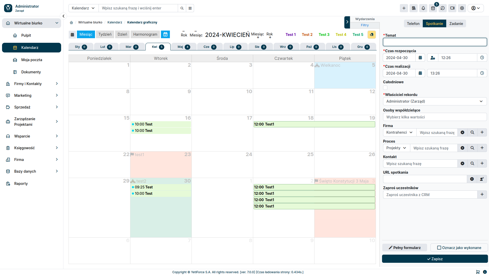
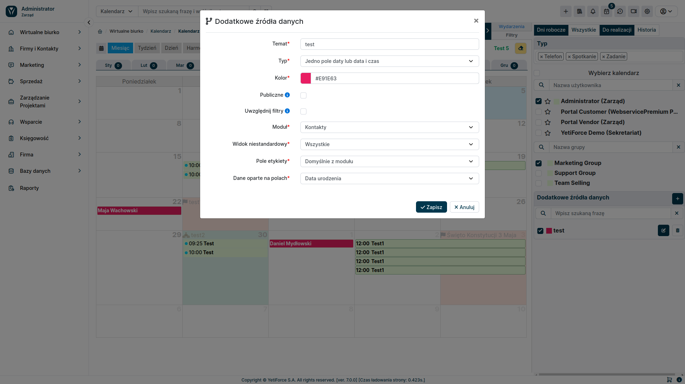

## Additional data sources

:::tip The functionality is available for YetiForce version `6.4.233` and later
:::

Dodatkowe źródła danych umożliwiają pokazanie informacji z wszystkich modułów z rekordami które posiadają pole daty lub daty czasu. Blok z konfiguracją jest dostępny w panelu filtrów z prawej strony.

### Opis pól

#### Tytuł

Nazwa która będzie pokazany w liście źródeł danych

#### Typ

Typ określa na podstawie ilu i jakich typów pól mają być prezentowane dane, dzięki takiemu rozwiązaniu system daje możliwość pokazania danych z zakresu lub na podstawie dwóch pól data i czas jako jednej wartości.

Do wyboru mamy następujące typy:

- One date field or date time
- Two fields date and time
- Time range for one date field or date and time field
- Time range for two date and time fields

#### Publiczne

Parametr określa czy dane źródło danych będzie widoczne dla innych użytkowników. Domyślnie każdy widzi tylko dwoje, a dzięki temu można współdzielić. Opcja dostępna tylko dla administratorów systemu.

#### Uwzględnij filtry

Zaznaczenie tej opcji zawęzi wyniki do wybranych użytkowników i grup. Pozostawienie tej opcji odznaczonej pokaże wszystkie wpisy, niezależnie od wybranych użytkowników i grup.

#### Moduł

Moduł z którego będą pokazywane dane.

#### Widok niestandardowy

Lista z filtrami dla wybranego modułu, daje to możliwość dodatkowego przefiltrowania wyświetlanych danych bazujących na warunkach z filtrów. Więcej informacji znajduje sie w artykule [Warunki filtrów](/user-guides/interface-guide/list-view/filter#conditions)

#### Pole etykiety

Lista wyboru umożliwia zmianę domyślnej etykiety rekordy na wybrane pole które chcemy pokazać w kalendarzu.

#### Dane oparte na polach

W zależności od wybranego typu dostępne będzie jedna lub cztery listy wyboru z polami dla wybranego modułu. Dane wyświetlanie w kalendarzu będą pokazane na podstawie wybranych pól.

### Uprawnienia

Funkcjonalność dodatkowych źródeł danych jest dostępna dla zwykłego użytkownika dopiero po nadaniu odpowiednich uprawnień.

Zarządzanie uprawnieniami odbywa sie w panelu [Konfiguracja systemu → Uprawnienia → Profile](/administrator-guides/permissions/profiles/)

Uprawnienia dzielą sie na dwie opcje:

- Kalendarz - Dodatkowe źródła danych - nadaje dostęp do całego bloku oraz wyświetlania danych
- Kalendarz - Tworzenie dodatkowych źródeł danych - daje możliwość tworzenia/edycji własnych źródeł danych
