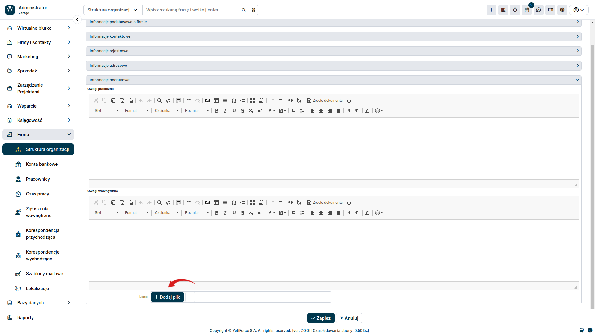

Dostosowanie systemu jest niezwykle ważne, ponieważ pozwala na stworzenie systemu, który jest bardziej odpowiedni dla jego użytkowników, zwłaszcza jeśli chcemy zmienić podstawowe elementy, takie jak logo ****. Domyślnie logo YetiForce znajduje się w kilku miejscach w systemie. Jeśli chcesz wiedzieć, jak go dostosować - ten artykuł jest dla ciebie.

## Zmień logo ekranu logowania

Pierwszym miejscem, gdzie logo YetiForce jest widoczne, jest ekran logowania. Jest to bardzo wrażliwe okno, dlatego nie powinno ono zawierać żadnych zbędnych informacji (ze względu na bezpieczeństwo), i powinna jasno określać, do kogo należy system.

System YetiForce pozwala na zmianę domyślnego logo na dowolny inny obraz. Aby to zrobić, przejdź do [Konfiguracja oprogramowania → Uprawnienia → Role](/administrator-guides/permissions/roles/). Po najechaniu kursorem na element na górze zobaczysz ikonę wysyłania obrazu.

Po kliknięciu na nią będziesz mógł przesłać nowe logo.

## Zmień logo menu

Logo, które możesz zobaczyć na górze menu, obok aktualnie zalogowanej nazwy użytkownika można zmienić w `Firma → Działy`. Wszystko, co musisz zrobić, to wybrać dział, następnie edytuj rekord za pomocą przycisku edycji ✎ w prawym górnym rogu - najpierw usuń bieżące logo, a następnie prześlij nowe. Po zapisaniu zmian nowe logo będzie widoczne w menu.

