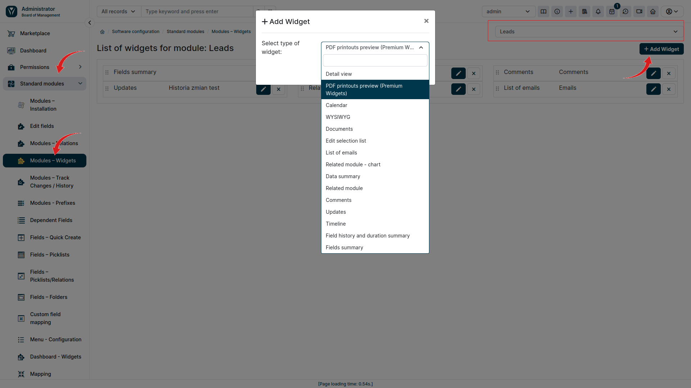
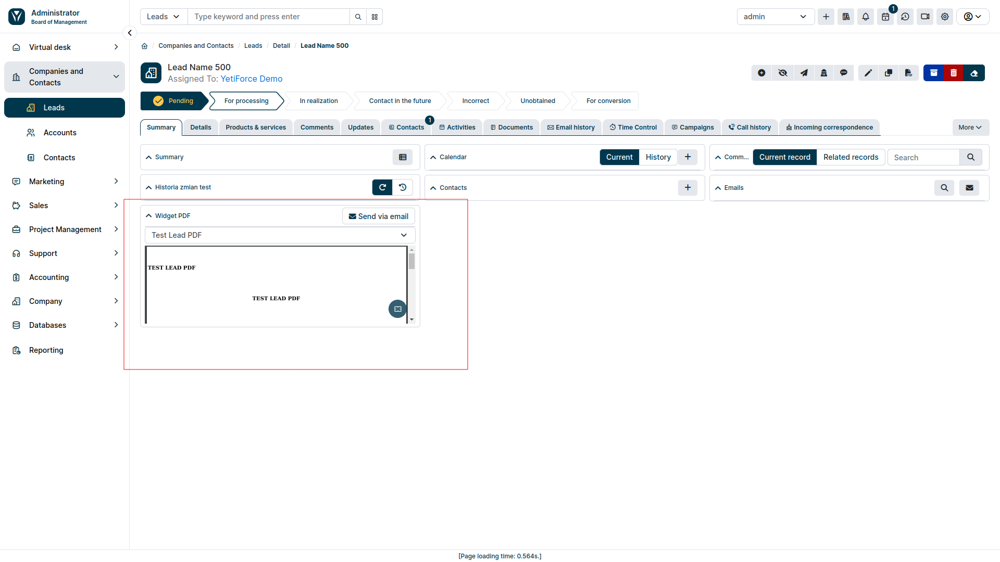
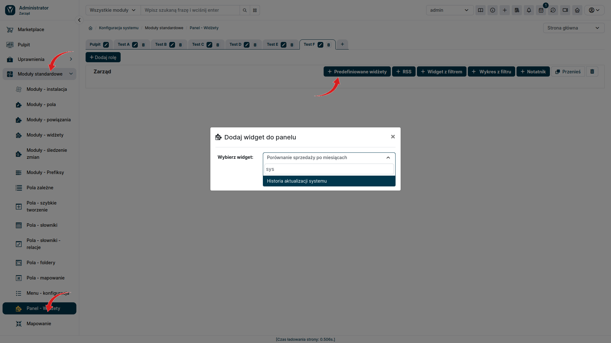
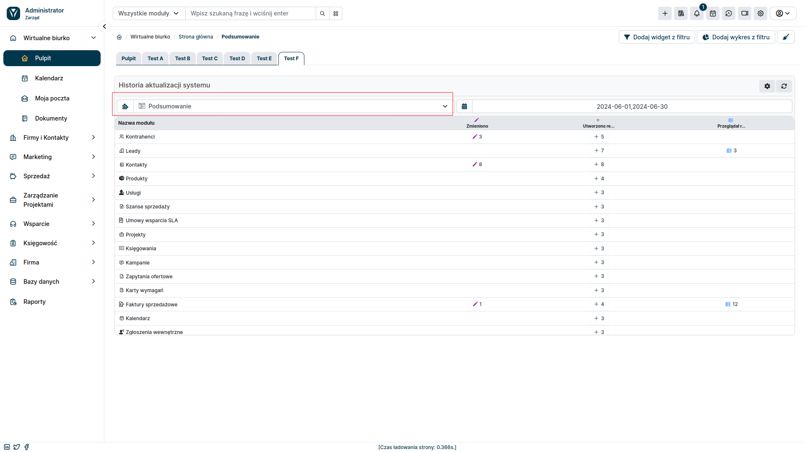

**widżety Premium**  pozwalają na wyświetlenie na pulpicie i w podsumowaniu rekordu dodatkowych informacji, dzięki czemu wszystkie niezbędne szczegóły mogą być dostępne dla użytkownika na wyciągnięcie ręki. W chwili obecnej w zestawie dostępne są 2 widżety - **Podgląd PDF** oraz **Historia zmian**

:::warning

widżet Podgląd PDF i Historia Zmian są dostępne tylko dla użytkowników YetiForce CRM z wykupioną subskrypcją widżety Premium.
:::

## Podgląd PDF
Jest to widżet, który pozwala na podgląd dokumentu PDF wygenerowanego przez system prosto z widoku podsumowania rekordu. Dzięki temu będziesz miał możliwość podglądu faktury, lub innego dokumentu PDF, prosto z rekordu, bez konieczności zapisywania go na dysku. Takie rozwiązanie znacznie ułatwi pracę użytkownikom odpowiedzialnym za wystawianie i przesyłanie dokumentów PDF, oraz pracownikom działu księgowego, którzy nie będą musieli pobierać faktur, by mieć do nich wgląd.

### Konfiguracja Podglądu PDF

W pierwszej kolejności należy się upewnić, czy dla danego modułu posiadamy stworzony szablon PDF.
Następnie możemy przejść do konfiguracji samego widżetu:

1. Przejdź do panelu administracyjnego YetiForce CRM.
2. Wybierz z lewego menu  Moduły standardowe ➜ Moduły widżety.
3. Z pola wyboru, po prawej stronie wybierz moduł, dla którego chcesz dodać widżet **Podgląd PDF**.
4. Kliknij przycisk Dodaj widżet.
5. Wybierz widżet **Podgląd PDF** z listy dostępnych widżetów
6. Wprowadź nazwę widżetu i zapisz zmiany

Widżet **Podgląd PDF** jest już gotowy do użycia. W panelu użytkownika, przejdź do modułu dla którego go dodałeś a następnie wybierz jeden z rekordów. Widżet powinien pojawić się na podsumowaniu rekordu.

## Historia zmian
Jest to widżet, który umożliwia wgląd w historię aktywności modułów. Pozwoli on na sprawdzenie wszystkich działań wszystkich użytkowników na wszystkich rekordach w danym module. Wyświetla on listę rekordów, które były otwierane lub modyfikowane przez użytkowników, czas operacji, oraz użytkownika, który danej operacji dokonał. widżet zawiera liczne zaawansowane filtry, które pozwolą skrócić czas wyszukiwania poszczególnych aktywności.

### Konfiguracja Historii Zmian

:::warning

Pamiętaj by przy tworzeniu widżetu wybrać odpowiednią rolę oraz pulpit, na którym ma się on pojawić.
:::

1. Przejdź do panelu administracyjnego YetiForce CRM.
2. Wybierz z lewego menu  Moduły standardowe ➜ Panel widżety.
4. Kliknij przycisk Predefiniowane widżety.
5. Wybierz widżet **Historia aktualizacji systemu** z listy dostępnych widżetów
6. Wprowadź parametry widżetu i zapisz zmiany

Widżet **Historia aktualizacji systemu** jest już gotowy do użycia. W panelu użytkownika przejdź do Zakładki **Pulpit**,  gdzie pojawi się widżet. 

