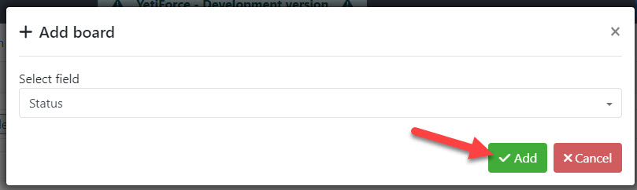

Tablice w widoku Kanban wykorzystują karty i kolumny które możemy łatwo konfigurować w panelu według potrzeb naszej firmy. Ponadto, w systemie YetiForce można stworzyć wiele tablic dla jednego modułu które przedstawią dane pogrupowane na różne sposoby.

:::warning

Tablica Kanban jest dodatkiem płatnym dostępnym w naszym Marketplace - [**Kup YetiForce Kanban Board**](https://yetiforce.com/pl/yetiforce-kanban)

:::

## Konfiguracja

Panel konfiguracyjny dodatku YetiForce Kanban Board można znaleźć w `Konfiguracja systemu → Moduły standardowe → Kanban`

Z listy dostępnych modułów, widocznej w prawym górnym rogu ekranu, należy wybrać moduł, w którym powinny być dostępne tablice Kanban:

## Tworzenie tablicy

Aby utworzyć nową tablicę należy kliknąć przycisk <kbd>+ Dodaj tablicę</kbd> i wybrać pole, które zostanie użyte do stworzenia tablicy w wybranym w poprzednim kroku module:

Po kliknięciu przycisku <kbd>Dodaj</kbd> tablica będzie dostępna w wybranym module.

## Parametry tablicy

- Pola szczegółowe - lista pól z których mają się pojawić dane z rekordu, jeśli pole ma ustawioną ikonę to będzie ona widoczna na tablicy Kanban. Dostępne są wszystkie pola z systemu z uwzględnieniem uprawnień użytkownika.

  

- Pola sumowania - lista pól które mają być sumowane dla danej wartości (słupka kanban-a) dla której jest wyświetlany kanban. Dostępne są tylko pola liczbowe, na których można wykonać operacje sumowania.

  

Dane na liście wyboru są zapisane automatycznie podczas każdej zmiany.

## Uprawnienia

Aby użytkownik mógł korzystać z widoku Kanban należy nadać mu odpowiednie uprawnienia w profilach.

W tym celu należy przejść do [`Konfiguracja systemu → Uprawnienia → Profile`](/administrator-guides/permissions/profiles/) wybrać odpowiedni profil, i dla właściwego modułu zaznaczyć opcje "Kanban".

