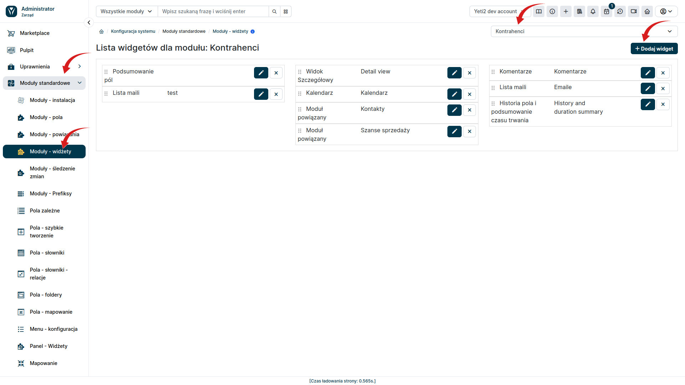
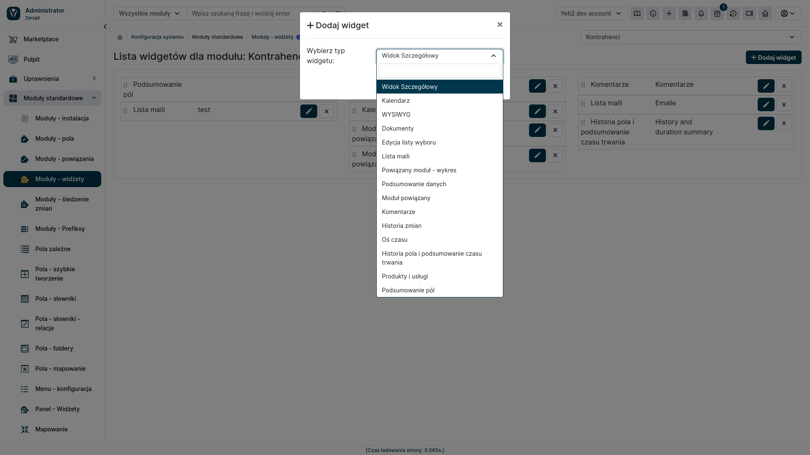
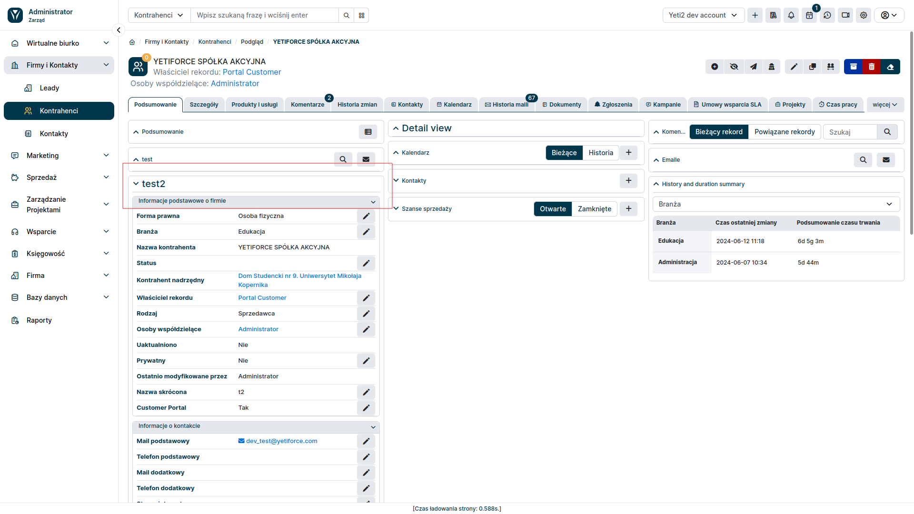

Oprócz widżetów umieszczanych na pulpicie nawigacyjnym, YetiForce CRM oferuje również możliwość dodawania widżetów do szczegółów danych poszczególnych elementów z listy. Funkcja ta pozwala na spersonalizowanie widoku i szybki dostęp do najważniejszych informacji dotyczących danego elementu, bez konieczności przechodzenia do innych modułów.

### Konfiguracja 

#### Dostęp do menu konfiguracji

* W panelu administracyjnym wybierz opcję **Moduły Standardowe** z menu głównego.
* Następnie kliknij **Moduły - Widżety**

#### Wybór modułu i dodawanie widgetu

* Z listy rozwijanej po prawej stronie wybierz moduł, dla którego chcesz dodać widget.
* Kliknij przycisk **Dodaj Widget**.

W oknie modalnym ustal wszystkie szczegóły odnośnie tworzonego widgetu.

Dodany widget będzie widoczny w szczegółach rekordów wybranego modułu.

