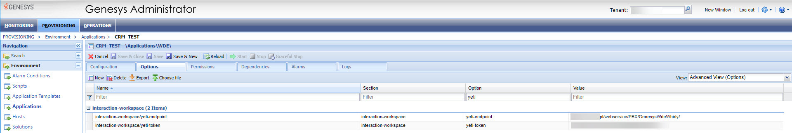

:::tip This functionality is available for YetiForce version 6.5 and later
:::

Integracja z centralą telefoniczną za pośrednictwem aplikacji Genesys Workspace Desktop Edition.

## Aktywuj

Due to the high complexity of the processes, the integration requires an extension implemented in Genesys from Whirly, and a dedicated implementation in the YetiForce system.

## Konfiguracja

W celu uruchomienia integracji należy wykonać poniższe kroki:

### Dodanie konfiguracji do PBX

Dodajemy wpis dp PBX o typie `Genesys WDE by Whirly`

W oknie należy podać następujące informacje:

- Port nasłuchu HTTP - numer portu lokalnego, na którym nasłuchuje aplikacja WDE
- Telefon - wymagany na potrzeby połączeń wychodzących, centrala umożliwia obsługę wielu numerów telefonu i należy określić, który jest używany po kliknięciu na numer telefonu.
- Email - wymagany na potrzeby wysyłania wiadomości mailowych, centrala umożliwia obsługę wiadomości mail i należy określić, który adres mail ma być użyty po kliknięciu na adres e-mail.

### Aktywacja dla użytkowników

Kolejnym krokiem jest aktywowanie integracji dla użytkowników, domyślnie system używa podstawowej obsługi protokołów dla telefonu i adresu mail.

Należy wejść na użytkownika, który ma mieć aktywną integrację i odnaleźć pola:

- Genesys Agent ID (blok `Informacje podstawowe`) - wprowadzamy login użytkownika w Genesys WDE

- Kompozytor poczty (blok `Integracja z pocztą e-mail`) - wybieramy `Genesys WDE by Whirly`
- PBX użytkownika (blok `Centrala telefoniczna`) - wybieramy nazwę, którą wprowadziliśmy we wcześniejszym punkcie [Dodanie konfiguracji do PBX](#dodanie-konfiguracji-do-pbx)

### Dodanie konfiguracji do API

Każda interakcja wysyła do API żądanie z pełnymi danymi i w odpowiedzi system YetiForce zwraca adres URL, który ma zostać uruchomiony użytkownikowi w Genesys WDE.

W tym celu należy dodać konfigurację w [`Konfiguracja systemu → Integracja → Web service - Aplikacje`](/administrator-guides/integration/webservice-apps/) o typie PBX.

Następnie należy skopiować klucz i wprowadzić go w konfiguracji Genesys Administrator.

### Dodanie konfiguracji do Genesys Administrator

W panelu Genesys Administrator wprowadzamy następujące parametry:

- Endpoint `__YETIFORCE_PATH__`/webservice/PBX/GenesysWdeWhirly/
- Token/klucz wygenerowany w `Web service - Aplikacje`

## Odnośniki zewnętrzne

- https://www.genesys.com/collateral/genesys-workspace
