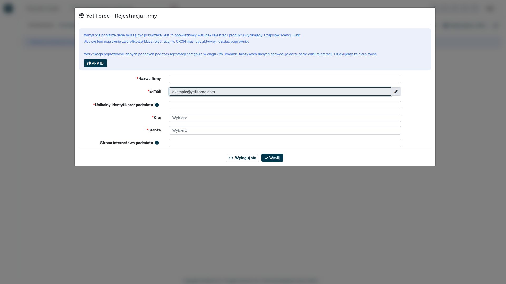
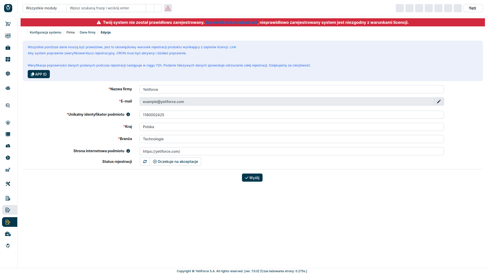

## Jak zarejestrować YetiForce?

Licencja [YetiForce Public License](/introduction/license-open-source) nakazuje rejestrację oprogramowania YetiForce. Rejestracja jest również niezbędna, jeśli chcesz dokonać zakupu produktów lub usług w Marketplace. Istnieją dwie metody poprawnej rejestracji Twojego systemu.

Poniżej przedstawiamy instrukcję krok po kroku, jak zarejestrować YetiForce, korzystając z wbudowanego w system formularza rejestracji online.

Jeśli system, który rejestrujesz, ma dostęp do internetu, to zarejestruj go online, według instrukcji poniżej. Jeśli system działa w trybie offline, to w treści [licencji](/introduction/license-open-source) znajdziesz instrukcję oraz wymagane informacje dotyczące rejestracji offline.

:::warning

Klucze rejestracyjne generowane są po ręcznej weryfikacji danych przesłanych przy rejestracji. Weryfikujemy przesłane informacje ręcznie, dlatego proces może trwać do 48 godzin. **Przesłanie formularza rejestracji offline nie przyspieszy rejestracji online.**

:::

Przejdź do konfiguracji systemu za pomocą kółka zębatego ⚙ widocznego w prawym górnym rogu ekranu.

W menu z lewej strony wybierz `Firma`, a następnie `Dane firmy`.

### Offline

### Online

Zapoznaj się z informacją widoczną na górze strony i wypełnij wszystkie obowiązkowe pola (oznaczone czerwoną gwiazdką) prawdziwymi danymi Twojej firmy.

Podanie fałszywych informacji spowoduje odrzucenie rejestracji.

Szczegółowy opis pól znajduje się w sekcji poniżej.

## Sprawdź status

Jeśli status rejestracji nie został automatycznie zaktualizowany w systemie po kilku dniach, to możesz go odświeżyć ręcznie. Aby to zrobić, kliknij przycisk `Sprawdź status`. Status rejestracji zostanie odświeżony natychmiast, a czas aktualizacji w prawym górnym rogu powinien zmienić się na `przed chwilą.` Jeśli nie, [artykuł](administrator-guides/company/problems-with-system-registration/) pomoże Ci rozwiązać problemy z rejestracją.

### Pola formularza

#### Rodzaj

- Użytkownik końcowy — podmiot używający systemu
- Dostawca — podmiot, który wdraża system dla innego podmiotu, który będzie z niego korzystał
- Integrator — podmiot, który integruje system

:::tip

Jeśli jesteś dostawcą/integratorem i chcesz zarejestrować system w imieniu klienta, pamiętaj, że obydwa podmioty muszą być zarejestrowane — Ty jako dostawca / integrator i klient jako użytkownik końcowy.

:::

#### Nazwa firmy lub imię i nazwisko

Podaj pełną nazwę firmy. W przypadku osób prywatnych podaj Twoje imię i nazwisko.

#### Unikalny identyfikator podmiotu

- W przypadku przedsiębiorstw należy podać unikalny identyfikator podatkowy stosowany w danym kraju, na przykład numer VAT.
- W przypadku osób prywatnych należy podać unikalny identyfikator nadawany w dniu narodzin np. PESEL.

#### Kraj

Kraj, w którym działa Twoja firma

#### Kod pocztowy

Podaj kod pocztowy miasta, w którym znajduje się Twoja firma.

#### Miejscowość

Podaj miasto w którym znajduje się Twoja firma

#### Adres

Podaj adres swojej firmy

#### Branża

Wybierz branżę z listy

#### Liczba pracowników zatrudnionych przez podmiot

Wprowadź liczbę pracowników w firmie. Jest to liczba wszystkich osób zatrudnionych w firmie, nie tylko pracowników posiadających konta w YetiForce.

#### Strona internetowa podmiotu

Wprowadź stronę internetową podmiotu lub osobistą stronę internetową.

:::tip

**NIE WPROWADZAJ ADRESU URL GDZIE ZAINSTALOWANY JEST YETIFORCE!**

:::

#### Subskrypcja newslettera

Jeśli chcesz subskrybować nasz newsletter, podaj:

- Imię
- Nazwisko
- Adres email
