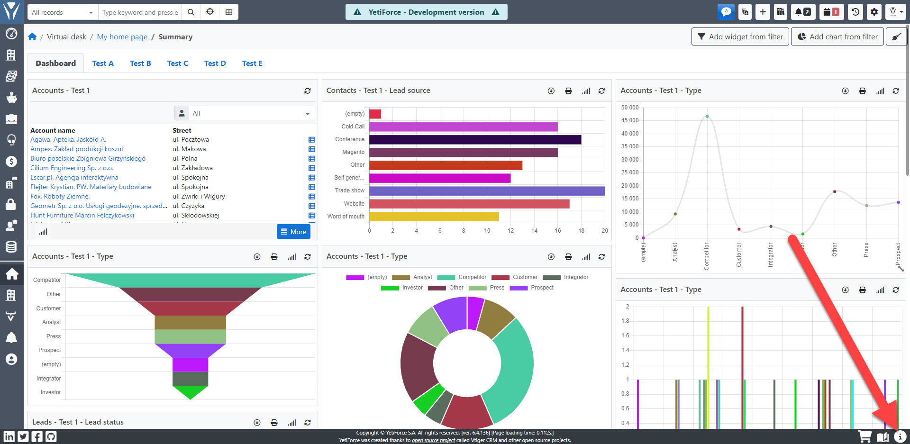

## Dlaczego powstał APP ID ?

### Rejestracja

Mechanizm rejestracji wymagał powiązania danych rejestracyjnych z konkretną instancją systemu YetiForce, co wymagało stworzenia unikalnego identyfikatora danej instancji. W przeciwnym razie identyfikacja systemu byłaby niemożliwa.

### Marketplace

Przy zakupie niektórych produktów w naszym Marketplace konieczne będzie przesłanie do nas informacji o APP ID, który identyfikuje system do którego zakupiony został dany dodatek. Jako producent systemu nie zbieramy żadnych identyfikujących informacji o systemie, dlatego przy zakupie usług, które musimy dla Państwa aktywować, konieczna jest weryfikacja APP ID.

## Z czego składa się YetiForce APP ID?

APP ID to suma kontrolna, w której skład wchodzą następujące składowe:

- **ID systemu**, które jest losowo generowane podczas instalacji i nie ulega zmianie ([$application_unique_key z pliku config/Main.php](https://doc.yetiforce.com/code/classes/Config-Main.html#property_application_unique_key))
- **Adres URL systemu**, pod którym jest dostępny system CRM ([$site_URL z pliku config/Main.php](https://doc.yetiforce.com/code/classes/Config-Main.html#property_site_URL))
- **Nazwa hosta serwera**, na którym znajduje się system CRM

:::warning
Wykupione dodatki przestaną działać jeśli APP ID naszego systemu ulegnie zmianie. Przeczytaj FAQ na dole strony z Dodatkami by dowiedzieć się jak je ponownie aktywować.
:::

## Dlaczego APP ID ulega zmianie?

Identyfikator musi zawierać elementy unikalne dla każdego serwera, aby ID był unikalny i nie powielał się, dlatego posiada kilka składowych. Jeśli któryś z opisanych wyżej części APP ID ulegnie zmianie, system będzie wymagał ponownej rejestracji.

Często APP ID zmienia się w środowisku Docker, gdy nie zostało ono odpowiednio zabezpieczone przed zmianami APP ID. W przypadku migracji systemu YetiForce CRM na inny serwer APP ID również ulegnie zmianie.

Poniżej przedstawiamy krótką instrukcję pokazującą gdzie znaleźć APP ID.

## Gdzie znaleźć APP ID

### Dla wersji 6.0 i nowszych

#### Krok 1A Domyślny branding YetiForce

Ten krok ma zastosowanie w systemach używających domyślnego brandingu YetiForce. Jeśli w Twoim systemie została wykupiona usługa [Disable YetiForce Branding](https://yetiforce.com/pl/yetiforce-branding) przejdź do kroku 1B.

Jeżeli używasz domyślnego brandingu kliknij ikonę <i className="fas fa-info-circle fa-fw"></i> w prawym górnym rogu.

#### Krok 1B Niestandardowy branding

Jeśli w Twoim systemie jest aktywna subskrypcja [Disable YetiForce Branding](https://yetiforce.com/pl/yetiforce-branding) kliknij na ikonę koła zębatego <i className="fas fa-cog fa-fw"></i> w prawym górnym rogu by przejść do ustawień. Następnie kliknij ikonę <i className="fas fa-info-circle fa-fw"></i> ina górze ekranu.

#### Krok 2 Okno modalne z danymi

APP ID pokaże się w oknie modalnym. Skopiuj je i prześlij na hello@yetiforce.com łącznie z informacją o transakcji PayPal oraz adresem email użytym przy transakcji.

### Dla wersji 5.3 i starszych

#### Krok 1

Przejdź do konfiguracji systemu za pomocą kółka zębatego <i className="fas fa-cog fa-fw"></i> widocznego w prawym górnym rogu ekranu

#### Krok 2

W menu z lewej strony wybierz [`Firma`](/administrator-guides/company) a następnie [`Dane firmy`](/administrator-guides/company/company-details/). Następnie kliknij `Rejestracja - Klucz` u góry ekranu.

#### Krok 3

APP ID pokaże się w oknie modalnym. Skopiuj je i prześlij na hello@yetiforce.com łącznie z informacją o transakcji PayPal oraz adresem email użytym przy transakcji.

