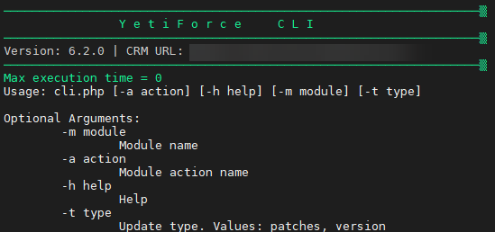

Opis interfejsu CLI (Command Line Interface) do obsługi niestandardowych operacji systemu YetiForce.
Dostępne od wersji `6.2.0`


## Jak uruchomić YetiForce CLI

Konsolę zawsze uruchamiany z głównego katalogu systemu YetiForce, czyli tam gdzie znajduje sie plik cli.php.

:::tip
YetiForce CLI musi być zawsze uruchamiany na użytkowniku systemu operacyjnego, który jest właścicielem plików systemu YetiForce.
:::

Możliwe komendy w zależności od środowiska:

```bash
php cli.php
/usr/local/php74/bin/php74 cli.php
sudo -u yfprod php cli.php
```

## Pomoc

Pomoc zawsze dostępna po dodaniu argumentu `-h`

```bash
php cli.php -h
```



## Dostępne moduły YFCLI

import DocCardList from '@theme/DocCardList';

<DocCardList />
