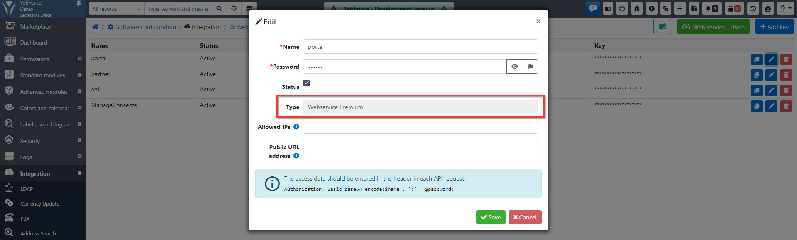
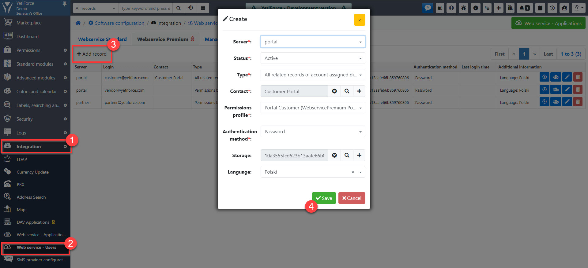

Jednym z elementów instalacji portalu jest skonfigurowanie systemu, tak aby portal był gotowy do użycia. Poniższy tutorial pokazuje jak prawidłowo skonfigurować system.

## Profile

Utwórz nowy profil, który określi jakie uprawnienia są przyznawane użytkownikom portalu. Profilami zarządzać można w [`Konfiguracja systemu → Uprawnienia → Profile`](/administrator-guides/permissions/profiles/).

## Role

Profil musi być przypisany do nowej roli. W tym celu przejdź do [`Konfiguracja systemu → Uprawnienia → Role`](/administrator-guides/permissions/roles/) i utwórz nową rolę z wykorzystaniem wcześniej utworzonego profilu.

## Użytkownicy

Utwórz nowego użytkownika z rolą, którą utworzyłeś w poprzednim kroku. Aby to zrobić, przejdź do [`Konfiguracja systemu → Uprawnienia → Użytkownicy`](/administrator-guides/permissions/users/). Użytkownik będzie potrzebny do zdefiniowania uprawnień i będzie domyślnym właścicielem nowo utworzonych rekordów.

## Web service - Aplikacje

Następnym krokiem jest dodanie aplikacji dla API w [`Konfiguracja systemu → Integracja → Web service - Aplikacje`](/administrator-guides/integration/webservice-apps/). Typ aplikacji powinien być ustawiony na `Webservice Premium`. Pozwoli to na używanie kontenera API o nazwie Webservice Premium. Pełną dokumentację można znaleźć na https://doc.yetiforce.com/api

:::warning
`Webservice Premium API` jest płatną funkcją i wymaga zakupu [YetiForce Webservice Premium](https://yetiforce.com/en/yetiforce-webservice-premium)
:::

## Menu

Innym kluczowym elementem prawidłowego funkcjonowania portalu jest menu. Panel konfiguracyjny menu można znaleźć w [`Konfiguracja systemu → Moduły standardowe → Menu - Konfiguracja`](/administrator-guides/standard-modules/menu/).

Dzięki utworzeniu oddzielnego menu dostępnego wyłącznie dla portalu można ograniczyć liczbę modułów dostępnych dla użytkowników portalu.

:::warning
Aby moduły były widoczne, musisz przyznać uprawnienia w profilach, w przeciwnym razie moduły nie pojawią się w menu.
:::

## Pola dostępowe do rekordu

:::warning
Ten krok jest wymagany tylko dla użytkowników webservice, o typie innym niż `Uprawnienia na podstawie użytkownika`.
:::

Gdy użytkownicy API są przypisani do kontaktów, wymagane jest dodanie pola, które pozwoli kontrolować dostęp do rekordów. Rekordy nie będą dostępne w portalu, jeśli to pole nie będzie skonfigurowane.

To rozwiązanie pozwala na posiadanie kilku portalów/aplikacji webservice i kontrolowanie dostępności rekordów dla każdego z nich osobno.

:::info
Każdy moduł, który powinien być dostępny w portalu musi zawierać to pole.
:::

### Konfiguracja pól znajduje się w [`Konfiguracja systemu→ Moduły standardowe → Moduły-pola`](/administrator-guides/standard-modules/edit-fields/).

### Zarządzaj dostępem do rekordów w portalu

## Widoczność i wymuszanie wartości domyślnych tylko dla portalu/API

Włączenie tej opcji spowoduje, że wszystkie rekordy utworzone z portalu/API będą mieć domyślnie tę samą wartość.

Zarządzanie polami portalu można znaleźć w [`Konfiguracja systemu → Moduły standardowe → Moduły - pola"`](/administrator-guides/standard-modules/edit-fields/)

## Uprawnienia dla wartości pól słownikowych

Dostępne wartości powinny być również określone dla pól słownikowych na podstawie ról. Bez tego ustawienia, użytkownik nie będzie widział listy wyboru dla pól słownikowych na podstawie ról podczas tworzenia lub edycji rekordów.

Panel można znaleźć w [`Konfiguracja systemu → Moduły standardowe → Pola – słowniki`](/administrator-guides/standard-modules/fields-picklists/)

## Web service - Użytkownicy

:::warning
Dla użytkowników webservice, których typ jest inny niż `na podstawie użytkownika` konto i kontakt powinny zostać utworzone wcześniej.
:::

Ostatnim krokiem jest dodawanie użytkowników portalu, co można zrobić w [`Konfiguracja systemu → Integracja → Webservice - Użytkownicy`](/administrator-guides/integration/webservice-users/).

Hasło można ustawić tylko z systemu podczas tworzenia użytkownika, portal oferuje tylko możliwość zmiany lub zresetowania hasła.

