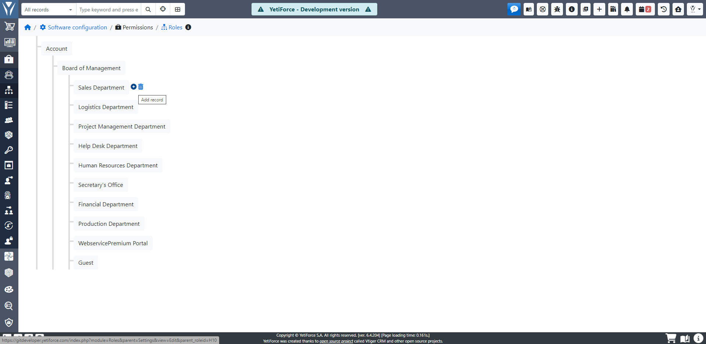

W systemie istnieje wbudowany moduł Ról, umożliwiający mapowanie struktury organizacyjnej firmy. Mechanizm ten może odzwierciedlać nawet najbardziej złożoną strukturę. Aby skonfigurować ten moduł, musisz przejść do "Konfiguracja systemu" i wybrać "Uprawnienia" i "Role".

Zacznijmy od przykładu organizacji, gdzie na samej górze mamy prezesa, pod nim dyrektora, pod nim trzech kierowników i każdy ma po jednym pracowniku. Jest to prosty przykład struktury, ale w systemie YetiForce nie ma ograniczeń jeśli chodzi o ilość poziomów, które można dodać.

