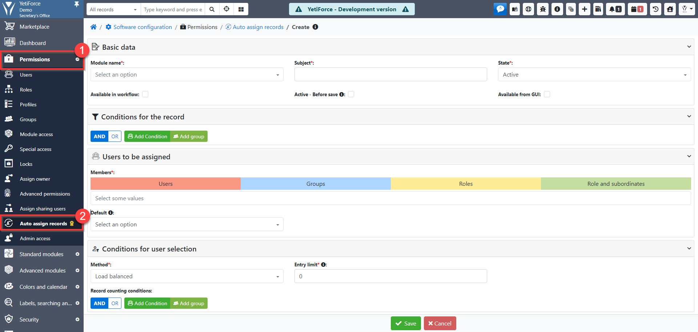
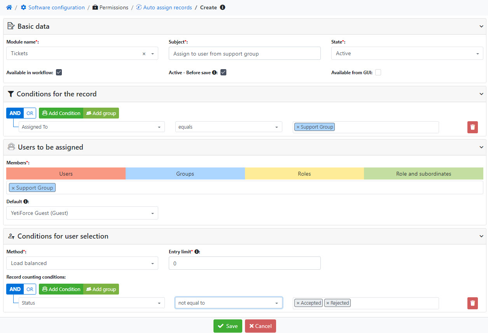
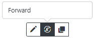
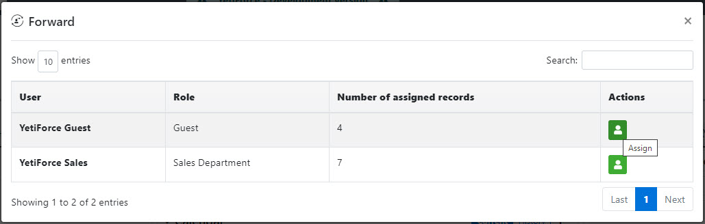

:::warning

Ten dodatek dostępny w naszym Marketplace - [**Kup YetiForce Automatic Assignment**](https://yetiforce.com/en/yetiforce-automatic-assignment)

:::

## Konfiguracja

W panelu automatycznego przypisania rekordów dostępne są następujące bloki ustawień:

- **Podstawowe ustawienia** - funkcjonalności, tj. wybór modułu i miejsca, w którym ma działać;
- **Kryteria dla rekordów** - a więc ustawienia warunków, które musi spełnić rekord, aby podlegał on automatycznemu przypisaniu;
- **Użytkowników do przypisania** - w tym element domyślny, gdy żaden z ustawionych użytkowników nie spełnia kryteriów dostępności;
- **Kryteria wyboru użytkownika** - które stanowią podstawy selekcji wybranych uprzednio użytkowników. Aktualnie do dyspozycji są dwie metody selekcji: _Zrównoważonego obciążenia (Load Balanced), Round Robin_.

:::important

Uwaga! Mechanizm działa tylko dla użytkowników, którzy w konfiguracji mają włączoną możliwość automatycznego przypisywania rekordów. Nie dotyczy to opcji domyślnej.

:::  

## Opis

W pierwszej sekcji ustawień mamy dostępne trzy miejsca, z których można uruchomić dany proces automatycznego przypisania.

- **DOSTĘPNE W WORKFLOW** Zaznaczenie tej opcji spowoduje, że będzie ona dostępna w akcjach workflow, co umożliwi np. uruchomienie automatycznego przypisywania dla już istniejących wpisów.

- **AKTYWNE - PRZED ZAPISANIEM** Opcja aktywuje automatyczne przypisanie rekordów tylko dla nowo tworzonych rekordów, a więc przed ich utworzeniem.

- **DOSTĘPNE W GUI** Ta opcja umożliwia ręczne przepisanie rekordu. Jeżeli wszystkie warunki zostały spełnione, tzn. ustawione kryteria dla rekordu oraz nadano uprawnienia do akcji automatycznego przypisywania w profilu danego użytkownika, to na podglądzie rekordu pojawi mu się przycisk ręcznego przypisania, a więc przekazania rekordu.

Po jego kliknięciu ukarze się okno modalne z odpowiednio wyselekcjonowanymi i posortowanymi użytkownikami do przypisania.

