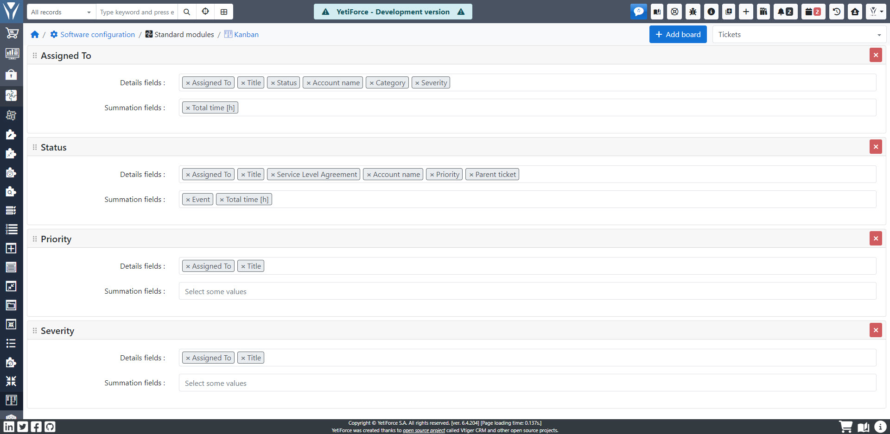
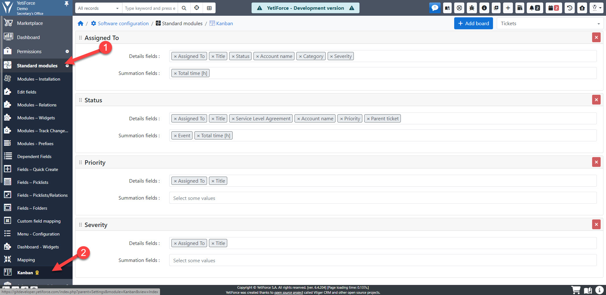
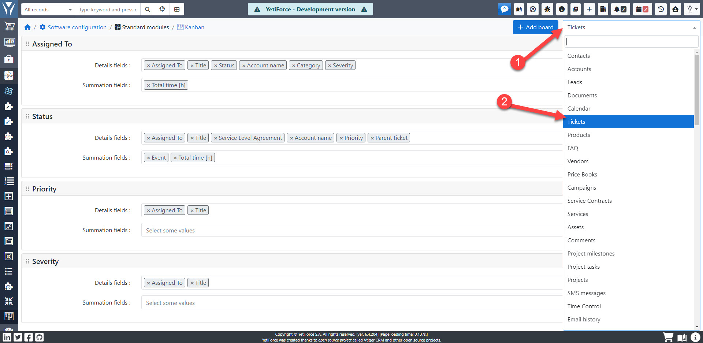
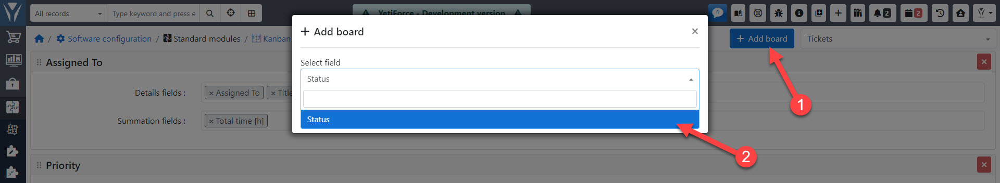
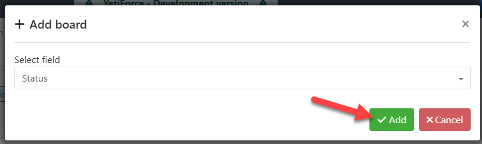
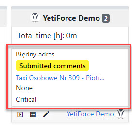
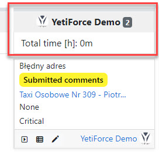
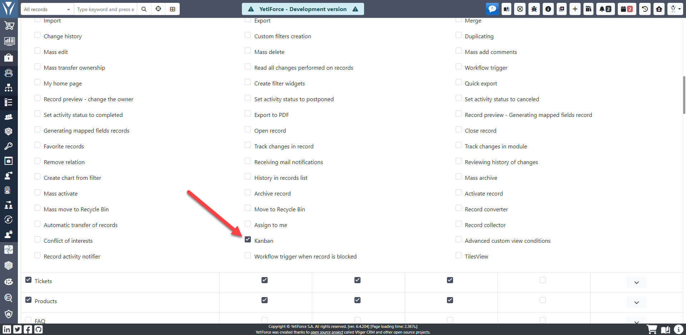

Tablice w widoku Kanban wykorzystują karty i kolumny, które można łatwo konfigurować w panelu według potrzeb firmy. Ponadto, w systemie YetiForce można stworzyć wiele tablic dla jednego modułu, które przedstawią dane pogrupowane na różne sposoby.

:::warning

Dodatek YetiForce Kanban Board można zasubskrybować w naszym Marketplace  - [**Kup YetiForce Kanban Board**](https://yetiforce.com/pl/marketplace/dodatki/92-yetiforce-kanban-board.html)

:::

## Konfiguracja

Panel konfiguracyjny YetiForce Kanban Borard znajduje się w `Konfiguracja oprogramowania → Standardowe moduły → Kanban`

Z listy dostępnych modułów, widocznej w prawym górnym rogu ekranu, należy wybrać moduł, w którym powinny być dostępne tablice Kanban:

## Tworzenie tablic

Kliknij przycisk <kbd>"+ Dodaj tablicę"</kbd> i wybierz pole, które zostanie użyte do stworzenia tablicy w wybranym w poprzednim kroku module:

Po kliknięciu przycisku <kbd>"Dodaj"</kbd> tablica będzie dostępna w wybranym module.

## Parametry tablicy

- Pola szczegółowe - lista pól z których mają się pojawić dane z rekordu. Jeśli pole ma ustawioną ikonę, to będzie ona widoczna na tablicy Kanban. Dostępne są wszystkie pola z systemu z uwzględnieniem uprawnień użytkownika.

  

- Pola sumowania - lista pól które mają być sumowane dla danej wartości (słupka kanbana), dla której jest wyświetlany kanban. Dostępne są tylko pola liczbowe, na których można wykonać operacje sumowania.

  

Dane na liście wyboru są zapisane automatycznie podczas każdej zmiany.

## Uprawnienia

Aby użytkownik mógł korzystać z widoku Kanban, należy nadać mu odpowiednie uprawnienia w profilach.

W tym celu należy przejść do [`Konfiguracja systemu → Uprawnienia → Profile`](/administrator-guides/permissions/profiles/) wybrać odpowiedni profil, i dla właściwego modułu zaznaczyć opcje "Kanban".

