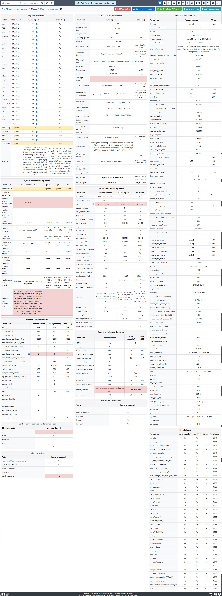
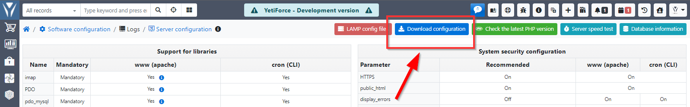
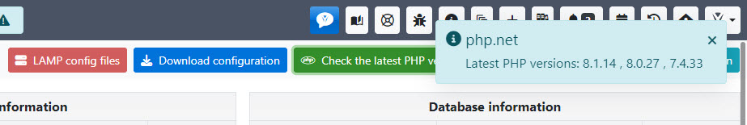
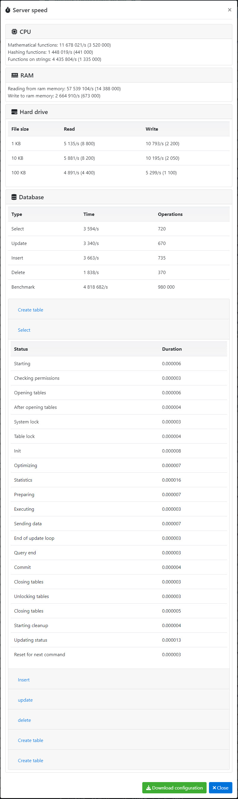
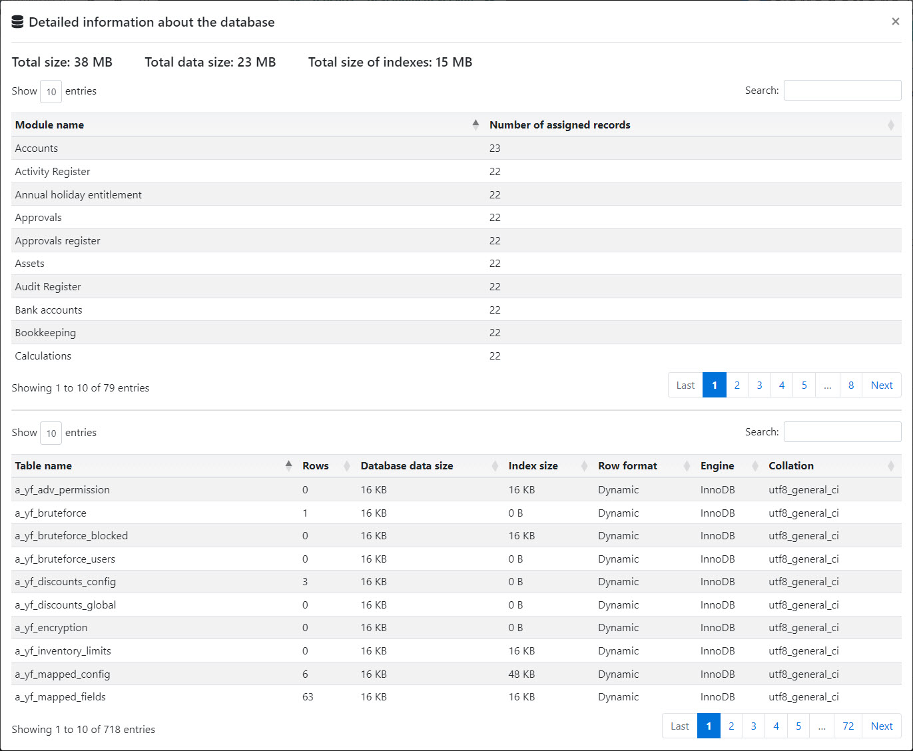

Panel konfiguracji serwera jest miejscem, w którym możesz podglądać ustawienia wszystkich parametrów serwera, w którym znajduje się system.

Funkcja ta może być niezwykle użyteczna, zwłaszcza jeśli wystąpią błędy systemowe - panel konfiguracji serwera wyróżni na czerwono wszystkie parametry i ustawienia, które nie spełniają wymagań YetiForce.

Oprócz wyżej wymienionych funkcji, ze względu na wygodę naszych użytkowników, panel został rozszerzony o następujące opcje:

## Pobierz konfigurację

Pozwala zapisać całą konfigurację wraz z elementami zaznaczonymi na czerwono jako plik .png. Dzięki temu rozwiązaniu możesz szybko pobrać i wysłać plik do odpowiedniego specjalisty do analizy.

## Sprawdź najnowszą wersję PHP

Pozwala sprawdzić najnowszą dostępną wersję PHP bezpośrednio w YetiForce.

## Testuj szybkość serwera

Wyświetla okno modalne z informacjami na temat serwera, jego procesora, pamięci RAM, dysku i bazy danych. Takie podsumowanie również można zapisać jako obraz.

## Informacje o bazie danych

Wyświetla szczegółowe informacje o bazie danych.

