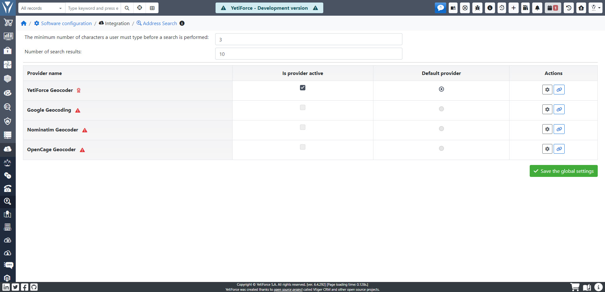

System YetiForce daje użytkownikom wiele udogodnień. Jednym z nim jest możliwość integracji systemu z systemem map Google lub z OpenCage Geocoder, co pozwala później systemowi na "podpowiadanie" użytkownikowi, kiedy ten wpisuje adresy do bazy (np. adres kontrahenta).

## Lista dostawców

### Google Geocoding

Wyszukiwarka bazuje na usłudze `Geocoding API` firmy Google i mapach Google.

- Dokumentacja: https://developers.google.com/maps/documentation/geocoding/
- Panel konfiguracyjny: https://console.cloud.google.com/apis
- Cennik: https://developers.google.com/maps/billing-and-pricing/pricing#geocoding

Wymaga utworzenia projektu z aktywną usługą `Geocoding API`

#### Przykładowa konfiguracja

- key: cccaSyDX2hI1YTV9B06ayBQ_99oClRp82kCZJ_2

### Nominatim Geocoder

Nominatim to usługa bazująca na mapach OSM

- Dokumentacja: https://nominatim.org/release-docs/develop/api/Search/

#### Przykładowa konfiguracja

- Country code: pl
- Map URL: https://nominatim.openstreetmap.org/search

### OpenCage Geocoder

OpenCage to usługa bazująca na mapach OSM

- Dokumentacja: https://opencagedata.com/api
- Cennik: https://opencagedata.com/pricing

#### Przykładowa konfiguracja

- Country code: pl
- key: 62672c4d90064d0589f6hbaeb058ll1c
