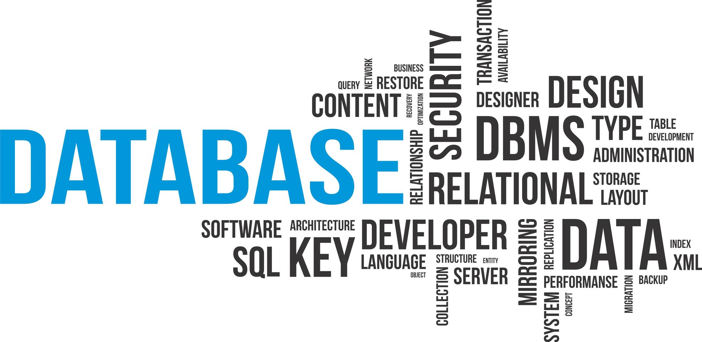

A proper configuration of the database server is an important element within the system implementation process. This article does not describe the configuration procedures but highlights a few crucial points in optimizing a server environment.

These guidelines are not mandatory, they are suggestions that result from many years of experience within the IT environment:

## Your friends are: vmstat / dstat, iostat, top, ps and any graphical history of values.

## Define the bottleneck (read/write, memory, CPU, network). How? Refer to point 1.

## Server optimization according to the process

problem analysis → consideration → change (only one change a time) → test → implement → begin the process again until you achieve satisfactory / optimal results.

## Hardware

- Recommended to use RAID 10 (RAID 5 may not be sufficient).
- In most cases the speed of CPU is the bottleneck, not the number of cores. It is a good idea to invest in faster CPUs.
- Use standard 1Gbit everywhere you can (in particular to connect application server to database server).
- Use drives with large cache (and protect it appropriately).
- Do not use virtualization for database servers!

## Software

- Use optimal systems (Debian, Ubuntu, RedHat, Mint).
- Use 64-bit architecture.
- Use the most up-to-date stable versions (kernel >= 2.6.12).
- Use mainstream file system, e.g. ext3, xfs.
- Not necessary to modify your operation system, because it is already optimal!
- Use a thread cache from your operation system.

## Data base

- The big three (key_buffer_size, innodb_buffer_pool_size, innodb_log_file_size).
- Do not modify anything, unless you know what it is for. Use ready-made configuration templates, which establish a proper database optimization. Ask a specialist for advice!
- Unconditionally use InnoDB! (and the optimization for this engine).
- Monitor slow queries to optimize them.

## Application

- Index
  - All attributes where you JOIN.
  - All attributes where you filter (WHERE).
  - All attributes where you ORDER or Group BY.
  - All attributes where you do an Index Scan.
- Order
  - Index elements only from left to right.
  - Fo compound indexes, e.g. INDEX (a, b), INDEX (a,b(10)).

The server optimization can increase the application speed up to 2x, the application optimization can increase the application operation up to 10x.
