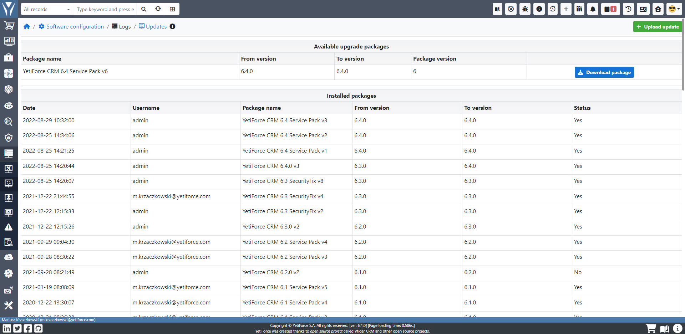
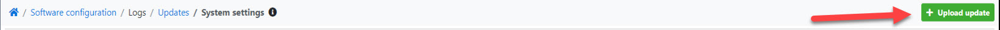
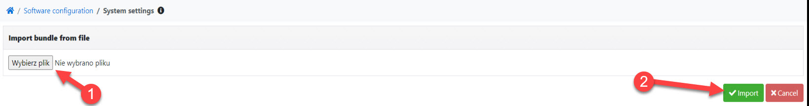
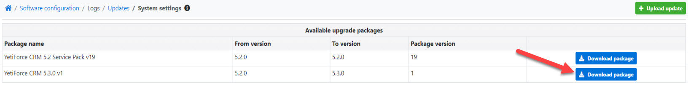
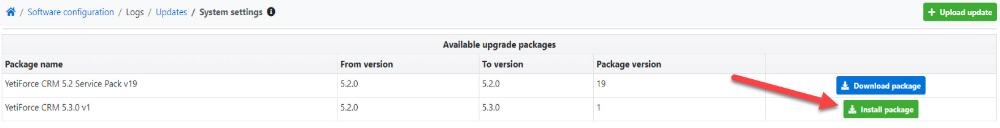
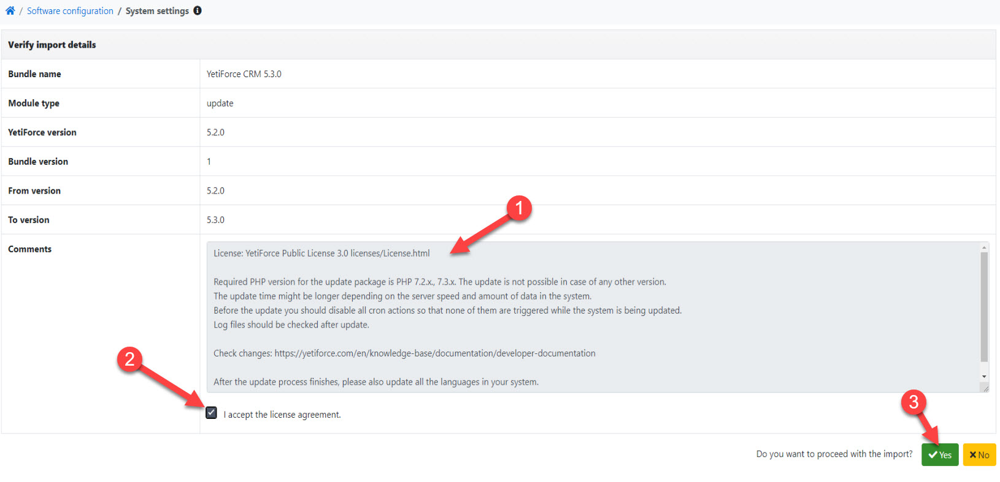
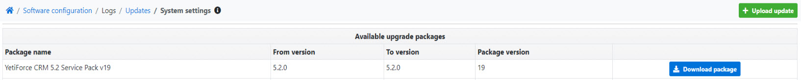

import Tabs from '@theme/Tabs';
import TabItem from '@theme/TabItem';
import ReactPlayer from 'react-player';

Proces aktualizacji systemu jest prostszy niż proces instalacji lub migracji, więc każdy administrator YetiForce powinien sobie z nim poradzić. **Przed próbą aktualizacji systemu należy zawsze wykonać kopię zapasową i rozpocząć proces w środowisku testowym.** Aktualizacje dokonywane bezpośrednio na środowisku produkcyjnym są jednym z najczęstszych błędów popełnianych przez młodych administratorów.

<Tabs groupId="zhh7fxZ293w">
    <TabItem value="youtube-zhh7fxZ293w" label="🎬 YouTube">
        <ReactPlayer
            src="https://www.youtube.com/watch?v=zhh7fxZ293w"
            width="100%"
            height="500px"
            controls={true}
        />
    </TabItem>
    <TabItem value="yetiforce-zhh7fxZ293w" label="🎥 YetiForce TV">
        <ReactPlayer src="https://public.yetiforce.com/tutorials/system-update.mp4" width="100%" height="500px" controls={true} />
    </TabItem>
</Tabs>

Aktualizacja systemu może być podzielona na 3 rodzaje działań, które obejmują dość ważne procesy:

## Czynności przedaktualizacyjne

- Wykonaj pełną kopię zapasową całego systemu (wszystkie pliki/foldery)
- Wykonaj kopię zapasową bazy danych
- Wyłącz Cron - można go wyłączyć w panelu administracyjnym (zalecane jest wyłączenie wszystkich zadań). Możesz również wyłączyć Cron zmieniając nazwę pliku cron.php
- Włącz logi([Debug](/6.4.0/developer-guides/debug#podsumowanie))
- Utwórz kopię zapasową systemu i wykonaj aktualizację testową

## Czynności podczas aktualizacji

Przejdź do Panelu Administracyjnego (Konfiguracja systemu), wybierz `Logi → Aktualizacje` w menu.

W wybranym oknie pojawią się dwie opcje do wyboru:

### Instalacja ręczna

W instalacji manualnej ważne jest, aby wcześniej pobrać odpowiednią paczkę dla danego systemu.

Paczkę aktualizacyjną można pobrać z kilku miejsc, jednakże zalecanym miejscem jest nasze repozytorium GitHub: https://github.com/YetiForceCompany/UpdatePackages/tree/master/. Znajdują się tam paczki aktualizacyjne do wszystkich wersji. Należy wybrać tę paczkę, która odpowiada obecnej wersji systemu. Aktualizacja wymaga zachowania odpowiedniej kolejności paczek. Jeżeli masz wersje. `1.1`. a chciałbyś uaktualnić system do wersji `2.0`, powinieneś pobrać następujące paczki aktualizacyjne:

- 1.1.0RC_to_1.2.0RC
- 1.2.0RC_to_1.3.0RC
- 1.3.0RC_to_1.4.0RC
- 1.4.0RC_to_2.0.0

Co prawda są wbudowane mechanizmy, które nie pozwolą wgrać niepoprawnej paczki, ale można je pominąć. Chociaż oczywiście nie jest to zalecane, niektóre osoby dokonujące aktualizacji mogą próbować zaoszczędzić czas. Domyślne paczki pozwalają aktualizować tylko ze stabilnych wersji [np. `1.2.0`, `1.4.`] i niemożliwa jest aktualizacja systemu z wersjami pośrednimi [zwanymi wersjami minor, e.. `1.2.54`, `1.4.11`]. Do takiej sytuacji może dojść w następujących przypadkach:

1. Pobrana została wersja systemu niestabilna [np. bezpośrednio z głównego folderu GitHub]. System powinien zostać pobrany z tego miejsca: https://github.com/YetiForceCompany/YetiForceCRM/releases
2. Została wgrana paczka aktualizacyjna dla wersji pośredniej. Można je pobrać np. z kanału developerskiego: https://github.com/YetiForceCompany/UpdatePackages/tree/developer/YetiForce%20CRM%201.x.x

Niezależnie od przyczyny, należy pamiętać:

1. Otwórz plik https://github.com/YetiForceCompany/YetiForceCRM/blob/master/config/version.php tylko na swoim serwerze gdzie zainstalowany jest system;
2. Zmień numer wersji na stabilny np. z wersji 1.4.55 na 1.4.0 (zawsze zmniejszaj wersję).

Mając odpowiednio dobraną wersję paczki aktualizacyjnej, możesz przejść do ręcznego sposobu jej wgrania, klikając w przycisk `Wgraj aktualizację`.

Wybierz odpowiednią wersję i kliknij `Importuj`.

### Instalacja z panelu

W tabeli `Dostępne pakiety aktualizacyjne` znajduje się lista pakietów, które system automatycznie wykrywa odpowiednio do posiadanej wersji.

Mając włączony internet po kliknięciu w `Pobierz pakiet` nastąpi pobranie wybranego pakietu.

Po ukończeniu pobierania pakietu możemy od razu przejść do instalacji, klikając w przycisk `Instaluj pakiet`.

Akceptacja licencji - jest to ostatni krok tak jak i w instalacji manualnej tak i w instalacji automatycznej. Jeśli wszystko przebiegło poprawnie, powinieneś zobaczyć okno z informacjami o numerze wersji i liście ważnych zmian, które wprowadza aktualizacja, i które mogą mieć wpływ na jej przebieg. Jeżeli jesteś gotowy i włączyłeś logi, to zaakceptuj licencję i rozpocznij aktualizację, wciskając przycisk `Tak`.

Prawidłowa instalacja zakończy się pokazaniem okna podsumowania lub przekierowaniem do pulpitu.

## Czynności po zakończeniu aktualizacji

### Weryfikacja aktualizacji

- Najpierw sprawdź logi i szukaj wszelkich błędów lub ostrzeżeń. Pliki dziennika mogą czasami zawierać 20 tysięcy linii kodu, więc zalecane jest użycie słów kluczowych, np. error, warning.
- Wyłącz dzienniki po kilku dniach używania systemu w celu sprawdzenia, czy występują błędy ([Debug](/6.4.0/developer-guides/debug#podsumowanie))
- Aktualizuj języki w systemie.
- Zaktualizuj bibliotekę lib_roundcube do wersji odpowiadającej systemowi.
- W panelu administratora, w [`Konfiguracja systemu → Standardowe moduły → Moduły - instalacja`](/administrator-guides/standard-modules/modules-installation/)możesz sprawdzić, czy wcześniej zainstalowana biblioteka wymaga aktualizacji.
- Zainstaluj najnowszą wersję Service Pack, jeśli została wydana dla danej wersji

Po zainstalowaniu aktualizacji możesz przejść do `Konfiguracja systemu → Logi → Aktualizacje` aby zobaczyć aktualnie dostępne Service Packi. Jeżeli w widoku listy nie będzie dostępnych wersji, to znaczy, że jest zainstalowana najnowsza wersja.

- Włącz Cron i sprawdź jego poprawne działanie. W tym celu można wejść do panelu administracyjnego, aby zobaczyć czy zostały uruchomione zadania cron-a i czy zostały zakończone prawidłowo.

## Testy prawidłowego działania systemu

- Przetestuj system, klikając w różne elementy, aby sprawdzić, czy wszystkie widoki działają (czy możesz edytować, modyfikować, usunąć rekord). Wykonuj te zmiany głównie jako nieuprzywilejowany użytkownik.
- Wykonaj niezbędne testy, na przykład wysyłanie wiadomości e-mail, generowanie dokumentów PDF, edytowanie ról lub reguł dostępu
- Sprawdź komunikację z systemami zewnętrznymi, np. integrującymi się poprzez API.

## Jak rozwiązać problemy

Najważniejszą rzeczą jest wiedzieć, jak analizować logi, ponieważ 99% rozwiązań można tam znaleźć. Ważne są zarówno logi aplikacji jak i logi serwera - są one doskonałym źródłem informacji. Kolejnym krokiem może być opisanie problemu na GitHub-ie, gdzie nasza społeczność i zespół YetiForce oferują darmową pomoc. Zanim utworzysz zgłoszenie (https://github.com/YetiForceCompany/YetiForceCRM/issues) przygotuj opis problemu krok po kroku, odpowiednie logi i zrzuty ekranu. Błędnie opisany problem może uniemożliwoć jego rozwiązanie. Możesz również sięgnąć po profesjonalne i płatne wsparcie ze strony zespołu YetiForce. Odwiedź naszą stronę [yetiforce.com](https://yetiforce.com/pl/uslugi/wsparcie-techniczne-i-biznesowe.html).
