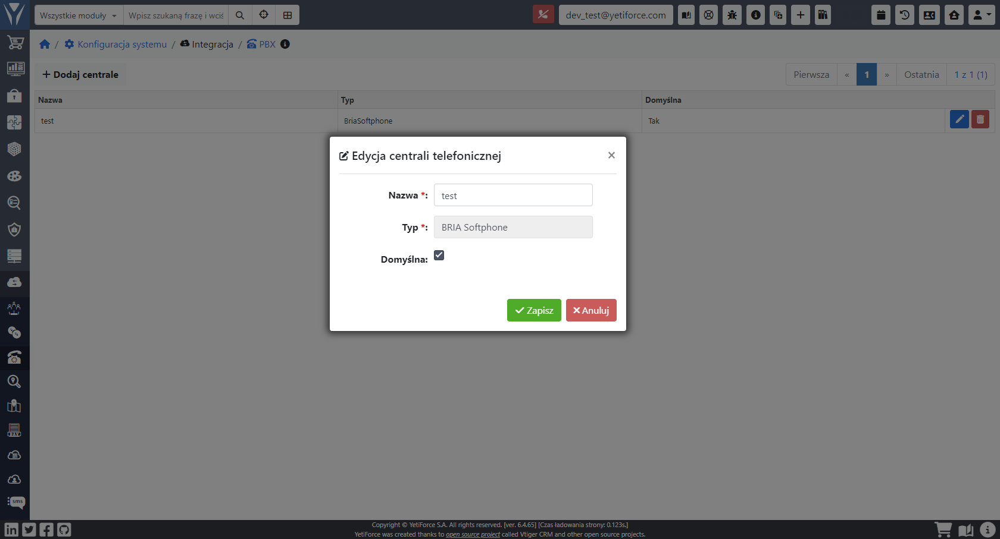
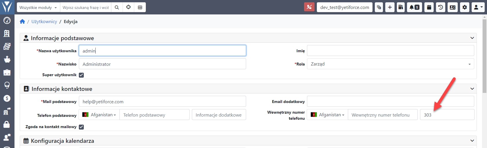
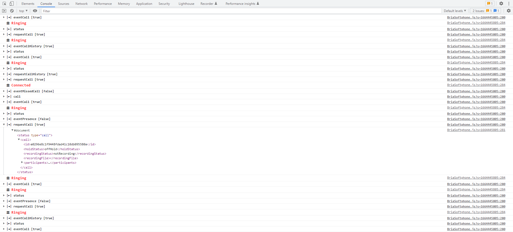

:::tip This functionality is available for YetiForce version 7.0 and later
:::

Integracja z centralą telefoniczną za pośrednictwem aplikacji Bria Softphone.

Połączenie z Bria Softphone bazuje na `Bria Desktop API`, dzięki któremu użytkownik w czasie rzeczywistym otrzymuje informacje o połączeniach.

Zalety i możliwości integracji:

- Zgodność z wiodącymi na rynku serwerami połączeń lub usługami VoIP (https://www.counterpath.com/international-voip-providers/)
- Dedykowana aplikacja dla użytkownika
- możliwość wybierania numeru telefonu z okna systemu YetiForce
- synchronizacja całej historii połączeń
- graficzna prezentacja statusu Twojego telefonu
- Obsługiwane plany: Bria Solo, Bria Teams , Bria Enterprise (https://www.counterpath.com/product-comparison/) nie obsługuje planu "Bria Solo Free"
- integracja z YetiForce za pomocą aktywnego okna przeglądarki


## Prezentacja wideo

import Tabs from '@theme/Tabs';
import TabItem from '@theme/TabItem';
import ReactPlayer from 'react-player';

<Tabs groupId="sWyz4oqKYwI">
    <TabItem value="youtube-sWyz4oqKYwI" label="🎬 YouTube">
        <ReactPlayer
            src="https://www.youtube.com/watch?v=sWyz4oqKYwI"
            width="100%"
            height="500px"
            controls={true}
        />
    </TabItem>
    <TabItem value="yetiforce-sWyz4oqKYwI" label="🎥 YetiForce TV">
        <ReactPlayer src="https://public.yetiforce.com/tutorials/integration-BriaSoftphone.mp4" width="100%" height="500px" controls={true} />
    </TabItem>
</Tabs>

## Konfiguracja

### Dodanie konfiguracji do PBX

Dodajemy wpis o typie `BRIA Softphone`



### Wprowadzanie numeru wewnętrznego w użytkownikach

Wprowadzamy wewnętrzny numer telefonu dla użytkowników, którzy mają mieć aktywną integrację z Softphone



## Status połączania z Softphone

Ikona na górnej belce systemu pokazuje aktualny status integracji z aplikacją Bria Softphone.

 Brak połączenia z telefonem

 Aktywne połączenie z telefonem, widać numer/nazwę aktualnie zalogowanego użytkownika w Softphone

 Rozmowa wychodząca lub przychodząca, pokazuje nazwę/numer rozmówcy

## Dialing

Jeśli integracja została aktywowana prawidłowo, to wszystkie pola o typie `telefon` będą miały dodatkową ikonę telefonu.

Po kliknięciu numeru lub ikony telefonu zostanie wywołana metoda do utworzenia połączenia z wybranym numerem telefonu.


## Połączenia przychodzące

Gdy otrzymujemy połączenie przychodzące system poinformuje o nim innym kolorem i ikoną oraz pokaże numer telefonu osoby dzwoniącej.


## Odnośniki zewnętrzne

- https://www.counterpath.com/softphone-clients/
- https://www.counterpath.com/teams-pricing/
- https://www.counterpath.com/bria-desktop-api/

## Debugowanie

W celu aktywacji logów w przeglądarce dla integracji należy ustawić w pliku [config/Debug.php](https://doc.yetiforce.com/code/classes/Config-Debug.html#property_JS_DEBUG) parametr [$JS_DEBUG](https://doc.yetiforce.com/code/classes/Config-Debug.html#property_JS_DEBUG) na `true`.

```php
/** Turn on/off error debugging in javascript */
public static $JS_DEBUG = true;
```


