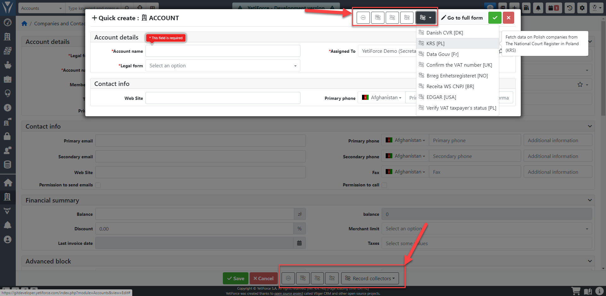

## Prezentacja wideo

import Tabs from '@theme/Tabs';
import TabItem from '@theme/TabItem';
import ReactPlayer from 'react-player';

<Tabs groupId="XlIXiQpC9ug">
    <TabItem value="youtube-XlIXiQpC9ug" label="🎬 YouTube">
        <ReactPlayer
            url="https://www.youtube.com/watch?v=XlIXiQpC9ug"
            width="100%"
            height="500px"
            controls={true}
        />
    </TabItem>
    <TabItem value="yetiforce-XlIXiQpC9ug" label="🎥 YetiForce TV">
        <ReactPlayer url="https://public.yetiforce.com/tutorials/record-collector.mp4" width="100%" height="500px" controls={true} />
    </TabItem>
</Tabs>

Kolektor rekordów jest używany do ładowania danych z różnych źródeł i umożliwia wyświetlanie i wczytywanie danych do systemu YetiForce CRM.

Mechanizm jest dostępny we wszystkich modułach, jednak musi być włączony i skonfigurowany dla każdego modułu do poprawnego działania.

## Konfiguracja

Kolekcjonerzy mogą być skonfigurowane w następującym panelu: [`Konfiguracja oprogramowania → Integracja → Kolekcjonerzy`](/administrator-guides/integration/record-collectors/)

## Dostępne kolektory

Poniżej znajduje się lista wszystkich aktualnie dostępnych kolektorów rekordów. Darmowe kolektory dostępne w systemie są domyślnie oznaczone tagiem, pozostałe mogą być zakupione w Marketplace. Regularnie dodajemy do systemu YetiForce nowe kolektory rekordów.

- GUS [PL] - Pobiera dane o polskich firmach z bazy danych REGON 1(BIR1) dostarczonej przez GUS
- ★ VIES [EU] - Sprawdza, czy podmiot gospodarczy posiada ważny numer VAT-UE dla transakcji wewnątrzwspólnotowych w Unii Europejskiej
- KRS [PL] - Pobiera dane o polskich firm z Krajowego Rejestru Sądowego w Polsce (KRS)
- Receita WS CNPJ [BR] - Pobieranie danych o firmach brazylijskich z bazy Cadastro Nacional de Pessoas Jurídicas dostarczonej przez Receita WS
- Swiss Zefix [CH] - Pobiera dane o spółkach szwajcarskich ze szwajcarskiego centralnego indeksu nazw przedsiębiorstw (Zentraler Firmenindex)
- Duński CVR [DK] - Pobieranie danych o duńskich i norweskich firmach przez CVR API z bazy Duńskiego centralnego rejestru przedsiębiorstw (CVR)
- Data Gouv [FR] - Pobieranie danych o francuskich przedsiębiorstwach z Państwowego Instytutu Statystyki i Badań Gospodarczych (Institut National de la Statistique et des Études Économiques)
- Brreg Enhetsregisteret [NO] - Pobieranie danych o norweskich przedsiębiorstwach z centralnej bazy Brønnøysund (The Brønnøysund Register Centre)
- North Data - Pobieranie danych firm z bazy North Data
- ★ Orb Intelligence - pobiera dane firm z całego świata
- CEIDG [PL] - Pobierz dane polskich firmy z Centralnej Ewidencji i Informacji o Działalności Gospodarczej w Polsce (CEIDG)
- VAT [PL] - Usługa umożliwiająca sprawdzenie, czy podmiot jest czynnym, zwolnionym czy też niezarejestrowanym podatnikiem w VAT w Polsce
- ★ YouControl [UA] - Pobieranie danych o ukraińskich firm dostarczone przez YouScore API z bazy YouControl
- Comapnies House [GB] - Pobiera dane z brytyjskich firm z agencji Comapnies House
- VAT [GB] - Sprawdza czy firma jest zarejestrowana jako podatnik VAT w Wielkiej Brytanii
- EDGAR [USA] - Pobieranie danych o firmach w USA z U.S. Securities andExchange Commission (SEC) z bazy EDGAR
- VATify.eu - Pobieranie danych firm z bazy VATify.eu, która również zawiera aktualny status płatnika VAT
