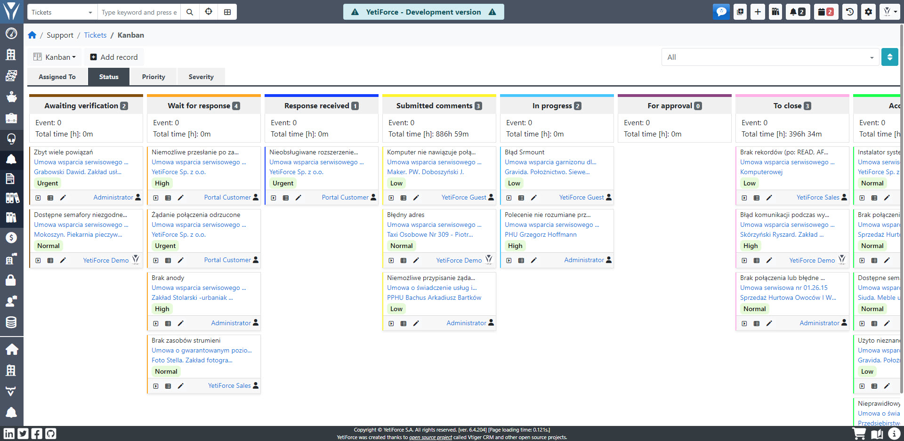
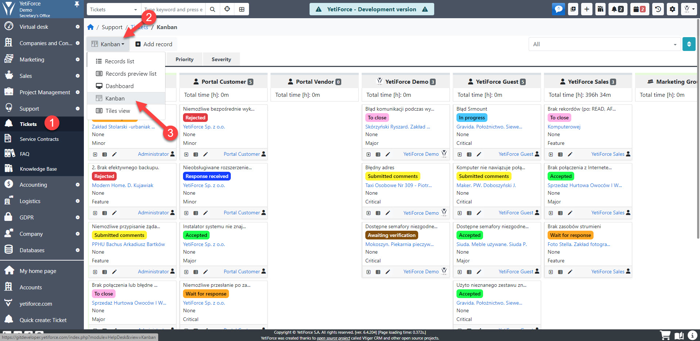
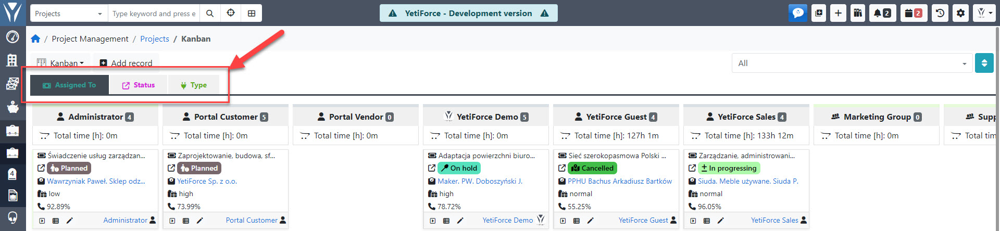

Tablica Kanban jest narzędziem wykorzystywanym głównie do zarządzania projektami, ale w systemie YetiForce CRM ten widok jest dostępny we wszystkich modułach użytkownika, gdzie przechowywane są dane. Kanban pomaga wizualizować dane, grupując je na różne sposoby, skutecznie definiując liczbę trwających prac i zwiększając wydajność

:::warning

Tablica Kanban jest płatnym dodatkiem dostępnym w Marketplace w Twoim systemie YetiForce.

:::

## Ustawienia widoku Kanban

Aby wyświetlić tablice Kanban w module, w którym wcześniej skonfigurowałeś tablice, wybierz moduł z menu i wybierz widok Kanban z listy wszystkich dostępnych widoków:

Jeśli więcej tabel zostało skonfigurowanych w danym module, będą one widoczne jako zakładki. Przełącz między kartami, aby wyświetlić różne tablice:

## Przenoszenie elementów

Aby przenieść elementy po prostu przeciągnij je i upuść przez dolny pasek. Kursor myszy zmieni się na <i class='fa-solid fa-up-down-left-right'></i> i pozwoli przeciągnąć okno:

## Konfiguracja

Panel konfiguracyjny tablicy YetiForce Kanban znajduje się w [`Konfiguracja oprogramowania → Standardowe moduły → Kanban`](/administrator-guides/standard-modules/kanban/)
