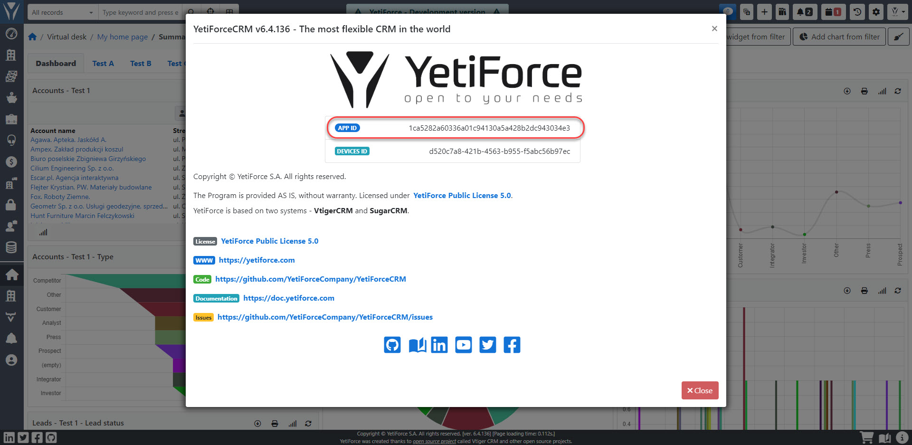
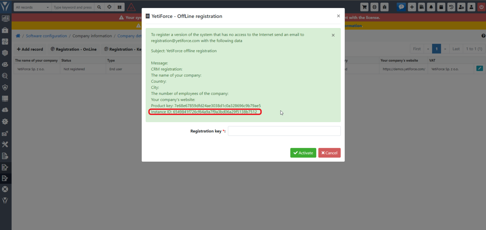

## Why was APP ID created?

### Registration

The registration mechanism required linking registration data with a specific instance of the YetiForce system, which required creating a unique identifier for a given instance. Otherwise, it would be impossible to identify the system.

### Marketplace

When you buy some of the products available in our Marketplace, you will need to provide us with your APP ID, which will verify which system the add-on has been purchased for. As the system producer, we don't collect any identifying information about the system, therefore, when you purchase services that we need to activate for you, we will have to verify the APP ID.

## What does YetiForce APP ID consist of?

APP ID is a checksum which includes the following components:

- **System ID**, which is randomly generated during the installation and doesn't change ([$application_unique_key from the config/Main.php file](https://doc.yetiforce.com/code/classes/Config-Main.html#property_application_unique_key))
- **System URL** where the system is located ([$site_URL from the config/Main.php file](https://doc.yetiforce.com/code/classes/Config-Main.html#property_site_URL))
- **Server Host Name** where the system is located

:::warning

If your APP ID changes all your purchased addons will be deactivated. Please check the FAQ at the bottom of the Addons page to find out how to activate them again.

:::

## Why does the APP ID change?

The APP ID must include unique elements for each server, so that the ID is also unique and not duplicated, which is why it has so many components. If any of the above mentioned parameters change, the APP ID will change as well, which will require the system to be registered once again.

The APP ID often changes in the Docker environment if it's not properly protected against APP ID changes. The APP ID will also change if you move your system to another server.

Below you can find a short tutorial on how and where to find the APP ID.

## Where to find APP ID

### For version 6.0 and newer

#### Step 1A - Default YetiForce branding

This step is for systems that use default YetiForce branding. If you purchased the [Disable YetiForce Branding](https://yetiforce.com/pl/yetiforce-branding) functionality please go to step 1B.

If you are using the default YetiForce branding click the <i className="fas fa-info-circle fa-fw"></i> icon in the bottom right corner.

#### Step 1B - Custom branding

If you purchased the [Disable YetiForce Branding](https://yetiforce.com/pl/yetiforce-branding) functionality please click on the cogwheel icon <i className="fas fa-cog fa-fw"></i> in the upper right corner to access System Settings, then click the <i className="fas fa-info-circle fa-fw"></i> icon at the top of your screen.

#### Step 2 - Popup with data

The APP ID can be found in the popup window. Copy the APP ID and send it to hello@yetiforce.com

Remember to include the PayPal transaction information and the email address you used for the transaction.

### For Version 5.3 And Older

#### Step 1

Go to system settings by clicking the cogwheel button <i className="fas fa-cog fa-fw"></i> in the upper right corner.

#### Step 2

In the menu panel on the left select [Company](/administrator-guides/company) and then [Company details](/administrator-guides/company/company-details/). Then click `Registration - Key` at the top of your screen.

#### Step 3

The APP ID can be found in the popup window. Copy the APP ID and send it to hello@yetiforce.com

Remember to include the PayPal transaction information and the email address you used for the transaction.

