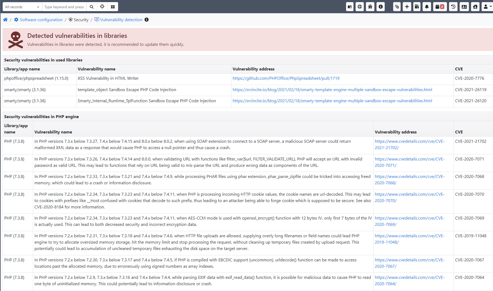
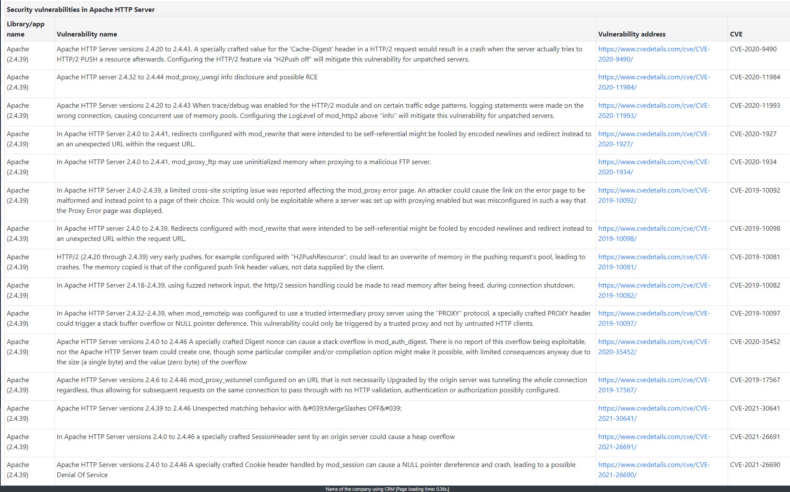
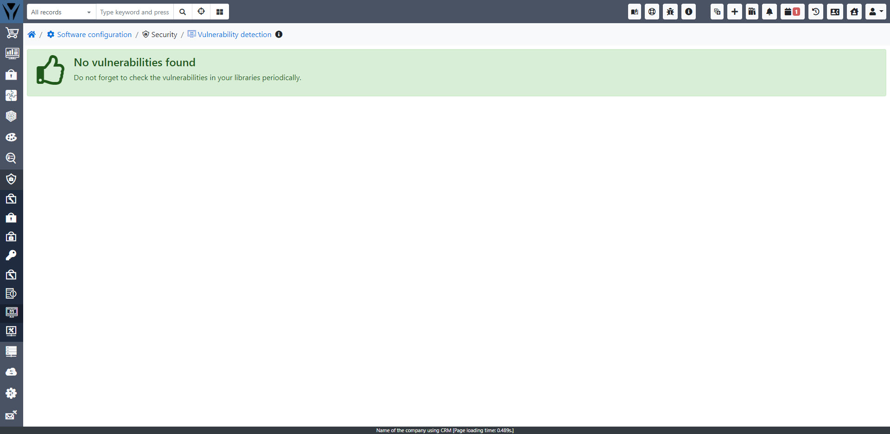
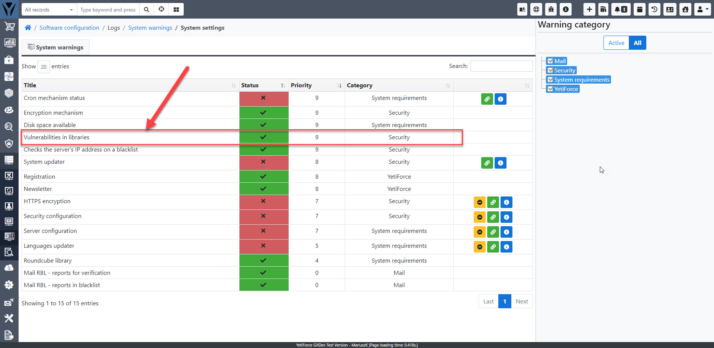

:::warning

Vulnerability scanner jest dodatkiem płatnym dostępnym w naszym Marketplace - [**Kup YetiForce Vulnerabilities**](https://yetiforce.com/en/yetiforce-vulnerabilities)

:::

Narzędzie sprawdza, czy w bibliotekach zewnętrznych występują jakiekolwiek podatności, które należy usunąć. Funkcja wymaga połączenia z Internetem, ponieważ wysyła informacje z composer.lock do usługi zewnętrznej. Wbudowany mechanizm bezpieczeństwa w obecnej wersji łączy się z dedykowaną usługą bezpieczeństwa YetiForce (https://security.yetiforce.com).

## Opis

Detektor podatności obecnie weryfikuje zagrożenia w światowej bazie danych CVE:

- biblioteki zewnętrzne używane w CRM (biblioteki napisane w PHP)
- podatności dla używanej wersji PHP
- podatności dla serwera WWW (Apache, Nginx)
- podatności dla bibliotek na serwerze: OpenSSL
- podatności dla silnika SQL (MySql, MariaDB)

Docelowo system będzie weryfikować wszystkie biblioteki zewnętrzne niezależnie od technologii. Dodatkowo mamy w planach wykrywanie podatności w aplikacjach zainstalowanych na serwerze np. IMAP, PGP, itp.

Pomimo że aplikacja potrafi domyślnie weryfikować tylko część bibliotek, to producent przed opublikowaniem stabilnej wersji sprawdza podatności we wszystkich bibliotekach za pomocą takich narzędzi jak: - https://snyk.io/, - https://security.symfony.com/, - https://depfu.com/, - https://blackducksoftware.com/, - https://david-dm.org/, - https://sonarcloud.io/

Jeśli nie zostaną znalezione żadne podatności, wyświetlona zostanie następująca wiadomość:

## YetiForce Security Dependency Check

Mechanizm wykrywania podatności na zagrożenia (security.yetiforce.com) działa na oficjalnej bazie danych podatności opartych na CVE, dostępnej pod adresem https://github.com/FriendsOfPHP/security-advisories.

## Ostrzeżenia systemowe

Wykrywanie podatności na zagrożenia jest również przeprowadzane w panelu `Ostrzeżenia systemowe` - system regularnie sprawdza luki w zabezpieczeniach i informuje administratorów o wszelkich potencjalnych zagrożeniach, którymi należy się zająć.

