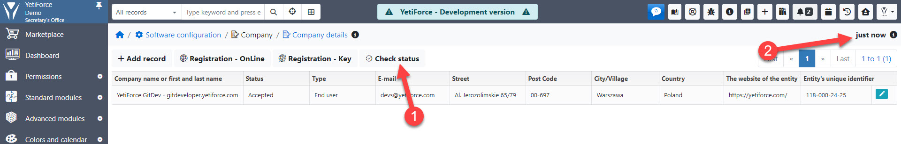

Poniższy artykuł pomoże Ci w przypadku problemów z zatwierdzeniem rejestracji lub jeśli status Twojej rejestracji po 24 godzinach od zarejestrowania nadal wyświetla informację o oczekiwaniu na akceptację.

Jeśli minęło już kilka dni od czasu przesłania formularza rejestracji online, a status rejestracji nadal wyświetla informację o oczekiwaniu na akceptację, możesz wykonać poniższe kroki:

## Zaktualizuj status rejestracji

Przejdź do ustawień aplikacji, w panelu menu po lewej stronie wybierz "Firma" a następnie "Dane firmy".

Kliknij przycisk "Sprawdź status". Czas ostatniej aktualizacji w prawym górnym rogu powinien zmienić się na "Przed chwilą".

Jeżeli czas nie ulegnie zmianie, proszę przejść do punktu 2.

## Sprawdź komunikat ostatniej weryfikacji statusu

W przypadku problemów z komunikacją z serwerem YetiForce pod ikoną będzie widoczna informacja o błędzie.

UWAGA! Komunikat pojawia się wyłącznie w przypadku błędów związanych z komunikacją. Jeśli występują inne błędy, to nie będą one tu widoczne.

## Jeśli nic się nie zmienia podczas sprawdzania statusu, upewnij się, że Twój serwer ma poprawną konfigurację

W tym celu przejdź do Konfiguracja systemu ➡ Logi ➡ Serwer – konfiguracja.

Najczęstszą przyczyną błędów w systemie i rejestracji jest nieprawidłowa konfiguracja serwera. Więcej informacji o konfiguracji serwera znajdziesz w [tym artykule](https://doc.yetiforce.com/pl/introduction/requirements/).

## Sprawdź logi

Jeśli występuje jakiś błąd podczas sprawdzenia statusu rejestracji, to na pewno będzie on zarejestrowany w logach CRM, PHP, FPM, lub serwera WWW.

Uruchom logi w systemie jak opisano w [artykule debugowania](/developer-guides/debug).

## Twoje APP ID uległo zmianie

Czasem po rejestracji są wprowadzane zmiany na serwerze, przez co zostaje zmieniony [APP ID](/administrator-guides/app-id/) systemu.

Z tego powodu system nie może pobrać aktualnych informacji, bo ID jest inny od tego, jaki był podczas rejestracji, a nowy nie istnieje w bazie.

W tym przypadku wymagana jest ponowna rejestracja; przejdź do [`Konfiguracja systemu ➡ Firma ➡ Dane firmy`](/administrator-guides/company/company-details/#jak-zarejestrować-yetiforce)

## Sprawdź zaporę sieciową

Sprawdź, czy Twoja zapora sieciowa nie blokuje ruchu wychodzącego na następujący adres:

- api.yetiforce.com (wersje YetiForce < 6.5)
- api.yetiforce.eu (wersje YetiForce >= 6.5)

Adresy te służą do rejestracji w systemie i zakupów w serwisie Marketplace.

## Jeśli problemy nadal występują - napisz do nas

:::warning

Kliknij przycisk `sprawdź status rejestracji` **PRZED WYSŁANIEM WIADOMOŚCI**, ponieważ wszystkie rejestracje są sprawdzane ręcznie.

:::

Jeśli masz problem z rejestracją i ten artykuł nie pomógł Ci rozwiązać problemu, wyślij wiadomość na hello@yetiforce.com i prześlij nam następujące informacje:

- [APP ID](/administrator-guides/app-id/)
- [Logi CRM](/developer-guides/debug)
- [Logi PHP](/developer-guides/debug#logi-php)
- Logi serwera
- Login FPM (opcjonalnie)
