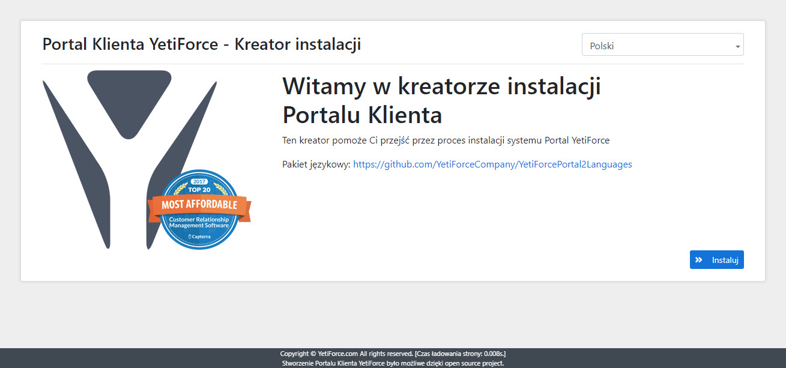
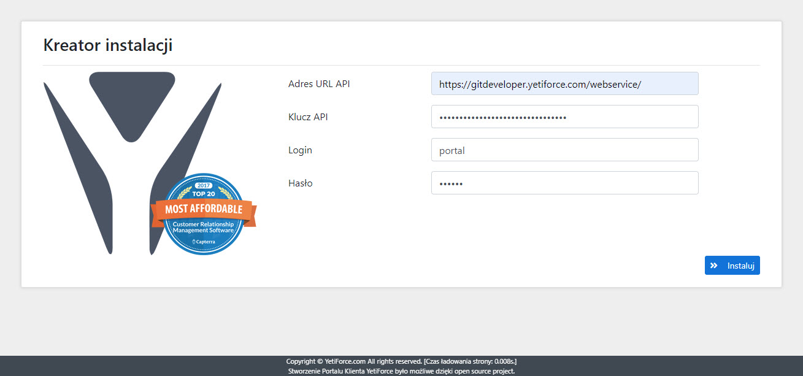

W tym artykule zaprezentowano jak szybko zainstalować [YetiForce Portal 2](https://github.com/YetiForceCompany/YetiForcePortal2). Portal może służyć jako miejsce przeznaczone dla klienta, dostawcy lub partnera. Jest to uniwersalne narzędzie do komunikacji z wszystkimi osobami, z którymi współpracujemy.

:::tip

**Koniecznie przeczytaj wszystkie poniższe informacje, zanim przystąpisz do instalacji YetiForce Portal2**

:::

import Tabs from '@theme/Tabs';
import TabItem from '@theme/TabItem';
import ReactPlayer from 'react-player';

<Tabs groupId="Language installation and update">
    <TabItem value="youtube" label="🎬 YouTube">
        <ReactPlayer
            src="https://www.youtube.com/watch?v=V-2x00bb4CI"
            width="100%"
            height="500px"
            controls={true}
        />
    </TabItem>
    <TabItem value="yetiforce" label="🎥 YetiForce TV">
        <ReactPlayer src="https://public.yetiforce.com/tutorials/portal2-installation.mp4" width="100%" height="500px" controls={true} />
    </TabItem>
</Tabs>

## Wymagania

Przed instalacją sprawdź, czy serwer spełnia wszystkie wymagania. Portal ma te same wymagania co [YetiForce system](/6.5.0/introduction/requirements/)

:::important
Osoba, która zamierza instalować portal, powinna mieć co najmniej podstawową wiedzę na temat serwerów internetowych, baz danych i uprawnień serwera. 99% problemów instalacyjnych wynika z niewystarczającej wiedzy osób, które instalują aplikację. Jeśli nie jesteś pewien, czy jesteś w stanie samodzielnie przeprowadzić proces instalacji, poproś o pomoc kogoś posiadającego odpowiednią wiedzę z zakresu IT. Cały proces instalacji zajmie od 2 do 10 minut.
:::

Uproszczona instrukcja instalacji znajduje się na [githubie YetiForcePortal2](https://github.com/YetiForceCompany/YetiForcePortal2#-installation)

## Instalacja YetiForcePortal2

Portal instaluje się tak samo, jak system YetiForce - przy użyciu kreatora w przeglądarce.

### Krok 1 - Pobierz i wgraj pliki systemowe

W pierwszej kolejności przygotuj pliki instalacyjne. Portal pobierzesz z naszych [oficjalnych źródeł](/6.5.0/introduction/download).

:::warning

Zalecamy pobranie wersji `complete`, np. `YetiForcePortal2-6.2-complete.zip`. Jeśli pobierasz wersję, która nie jest oznaczona jako `complete`, przed zainstalowaniem systemu musisz zainstalować biblioteki za pomocą `yarn` i `composer`.

Ważna jest kolejność - najpierw `yarn`, potem `composer`.

Przykładowy skrypt instalacyjny możesz pobrać [stąd](https://github.com/YetiForceCompany/YetiForceCRM/blob/developer/tests/setup/dependency.sh).

:::

- Rozpakuj plik, używając np. 7-Zip.
- Skopiuj katalog na serwer, używając np. FileZilla, WinSCP.
- Uruchom kreatora instalacji z poziomu web (gdzie skopiowałeś pliki portalu YetiForce) i wykonaj podane kroki.

Lub z konsoli bash:

```bash
cd /home/yfprod/html/
wget -O YetiForcePortal2.zip https://github.com/YetiForceCompany/YetiForcePortal2/releases/download/6.4/YetiForcePortal2-6.4-complete.zip
unzip YetiForcePortal2.zip
rm YetiForcePortal2.zip
chown -R yfprod:yfprod /home/yfprod/html/
```

### Krok 2 - Uruchom kreatora instalacji

Uruchom adres docelowy portalu w oknie przeglądarki, system powinien pokazać kreatora instalacji. Jeśli tego nie zrobi, możliwe, że wystąpiły jakieś problemy. Możesz spróbować przejść do adresu: **SITE_URL**/index.php?module=Install&view=Install np. https://gitdevportal.yetiforce.com/index.php?module=Install&view=Install



Możesz wybrać język instalacji na ekranie początkowym.

### Krok 3 - Wprowadź dane dostępowe

:::warning

**Ten krok wymaga aktywnego dostępu API !!!**

W przypadku problemów zapoznaj się z dokumentacją i informacjami dostępnymi na[GitHub](https://github.com/YetiForceCompany/YetiForcePortal2#-installation)

Dane dostępowe znajdziesz w [ Konfiguracja systemu → Integracje → Webservice - Aplikacje](/administrator-guides/integration/webservice-apps/) w systemie YetiForce
:::



### Krok 4 - Strona logowania portalu

Po kliknięciu `Zainstaluj` pojawi się strona logowania. Wprowadź dane logowania utworzone w panelu [`Konfiguracja systemu → Integracja → Webservice - Użytkownicy`](/administrator-guides/integration/webservice-users/)


